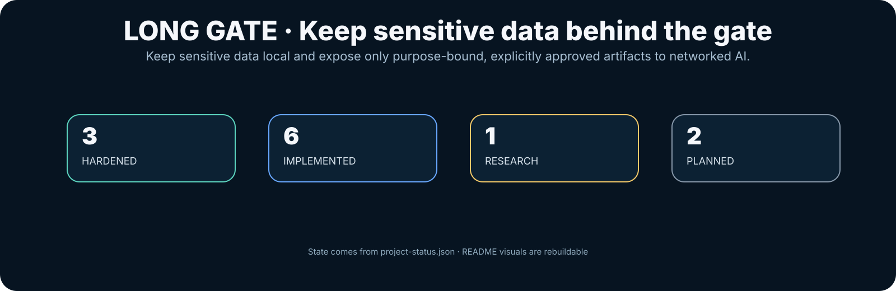
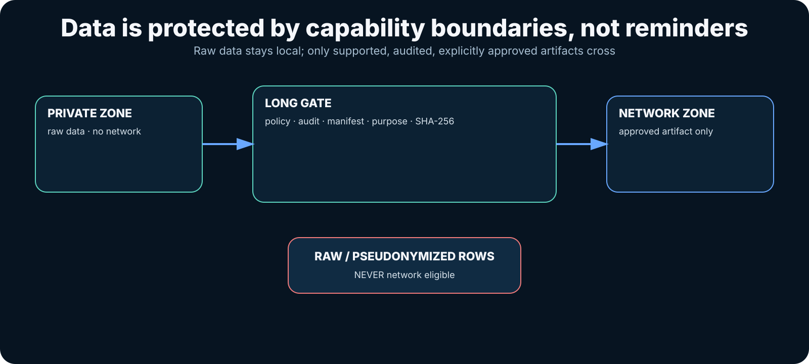
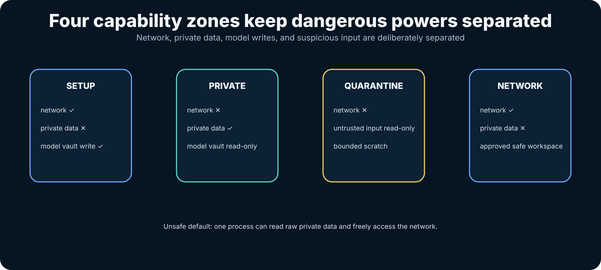
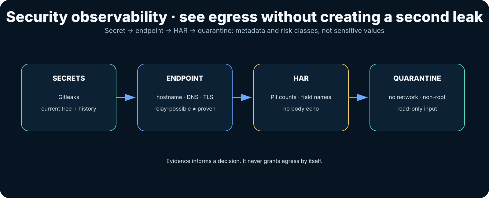
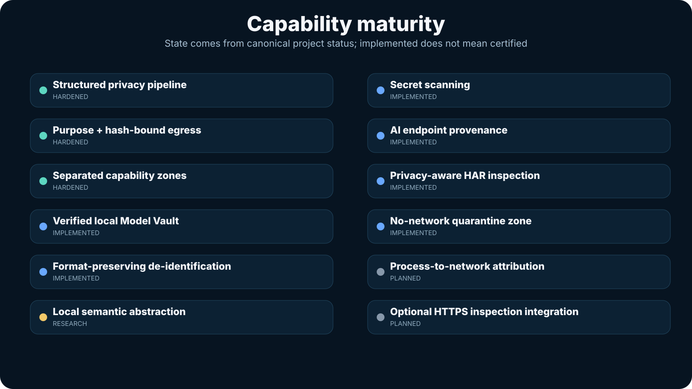
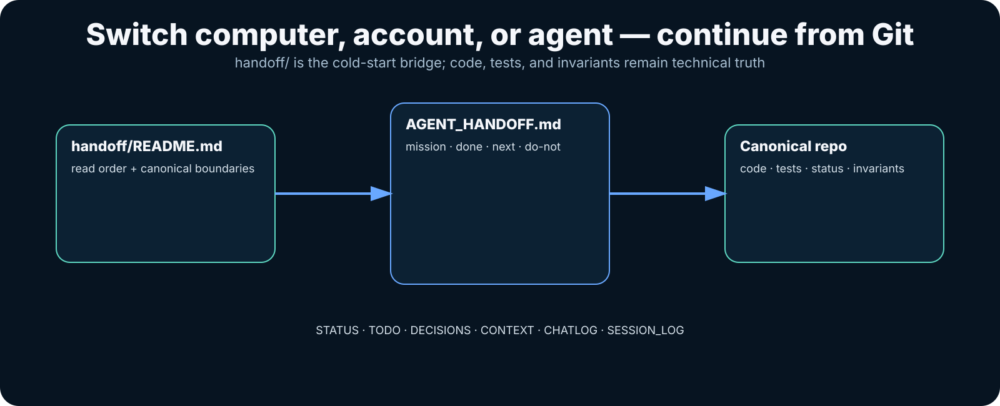

<p align="right">
  <a href="./README.en.md"></a>
  <a href="./README.md"></a>
</p>

<p align="center">
  
</p>

<p align="center">
  <a href="https://github.com/CochraneK/long-gate/actions/workflows/test.yml"></a>
  <a href="https://github.com/CochraneK/long-gate/actions/workflows/security-audit.yml"></a>
  <a href="https://github.com/CochraneK/long-gate/actions/workflows/benchmarks.yml"></a>
  
  
</p>

# Long Gate

**Let AI create value from sensitive data without giving networked AI the sensitive data itself.**

Long Gate is a **local-first privacy gateway and capability boundary** for AI agents and AI workflows. It does not treat “please don't reveal this” as a security boundary.

> **If a networked AI should not see raw data, do not give it the capability to see raw data.**

## The 30-second version

<p align="center">
  
</p>

Current pre-1.0 posture:

| Data / artifact | Network eligibility |
|---|---|
| Raw row-level data | **Blocked** |
| Pseudonymized row-level data | **Blocked** |
| Row-level synthetic data | **pre-1.0 hard-lock / fail-closed** |
| Semantic de-identification output | **LOCAL_ONLY** |
| Supported disclosure-limited structured aggregate | Requires manifest + SHA-256 + purpose + explicit local approval |

**Evidence ≠ authorization.** Passing a scan, completing a transformation, or looking low-risk never creates network permission by itself.

## Start here

| I want to… | Start with |
|---|---|
| Inspect hardware and get local-model guidance | `longgate hardware` |
| Configure and verify a local model | `longgate setup` |
| Process CSV / XLSX / JSON / Parquet | `longgate run study.csv` |
| Compute real statistics locally | `longgate exact study.csv ...` |
| Create a format-preserving TXT / Markdown / HTML / XLSX / DOCX copy | `longgate deidentify FILE` |
| Batch related files with stable placeholders | `longgate deidentify-batch DIR --out-dir OUT` |
| Create a strongly abstracted local semantic summary | `longgate semantic-summarize FILE --out summary.txt` |
| Scan current files or Git history for secrets | `longgate secrets scan . --history` |
| Inspect whether an AI endpoint is official, routed, or custom | `longgate endpoint inspect URL` |
| Inspect an exported HAR without echoing prompts/secrets | `longgate egress inspect-har capture.har` |
| Examine suspicious input in a no-network zone | `docker compose -f docker-compose.quarantine.yml ...` |
| Continue the project from another agent/account/computer | Read [`handoff/README.md`](handoff/README.md) |

## Five-minute start

```bash
git clone https://github.com/CochraneK/long-gate.git
cd long-gate

python -m venv .venv
source .venv/bin/activate      # Windows: .venv\Scripts\activate

pip install -e '.[models,documents]'
longgate setup --recommend-only
longgate doctor
```

When ready to install the recommended verified model:

```bash
longgate setup
```

The `local-llm` extra is optional because `llama-cpp-python` includes native code. See the [Local Model Guide](docs/models.md) when platform-specific installation is needed.

## Capabilities are separated on purpose

<p align="center">
  
</p>

Long Gate separates:

- **Setup** — network access, Model Vault write, no private-data mount;
- **Private** — private data, Model Vault read-only, no network;
- **Quarantine** — suspicious input, no network, non-root, bounded resources;
- **Network** — network access, no private-data mount, approved SafeWorkspace only.

The unsafe default Long Gate tries to remove is:

> **One process that can both read raw private data and freely access the network.**

## Security observability

<p align="center">
  
</p>

### Secret scanning

```bash
longgate secrets scan .
longgate secrets scan . --history
```

The local adapter uses Gitleaks. User-facing Long Gate results expose finding counts, paths, and rule IDs — not secret values. CI also runs a blocking full-history secret scan.

### AI endpoint / relay provenance

```bash
longgate endpoint inspect https://api.openai.com/v1
longgate endpoint inspect https://example-proxy.test/v1 --no-connect
```

Long Gate can combine hostname, DNS, IP, and TLS-certificate evidence to describe the endpoint the client actually connects to.

It deliberately does **not** claim:

```text
custom endpoint observed
        =
hidden upstream provider proven
```

Unknown/custom endpoints therefore remain **relay-possible / unknown** unless stronger evidence exists.

### Inspect what classes of data leave

If a browser or explicitly configured local proxy exported a HAR:

```bash
longgate egress inspect-har capture.har
```

The report can show destination hosts, body byte counts, PII counts, and sensitive header/query **names**. It intentionally avoids echoing Authorization values, cookies, query values, matched PII, or full request bodies.

### Quarantine

`docker-compose.quarantine.yml` defines a restricted analysis zone:

```text
no network
non-root
read-only root
read-only input
drop ALL capabilities
no-new-privileges
blank common AI/cloud credentials
bounded tmpfs / CPU / RAM / PID
```

It is a capability-restricted analysis zone, not a claim of protection against a compromised kernel, container runtime, or host administrator.

## Capability maturity

<p align="center">
  
</p>

The state comes from [`project-status.json`](project-status.json). **Implemented / Hardened does not mean compliance-certified.**

Current follow-up areas include:

- process → socket/network attribution;
- explicit opt-in HTTPS inspection-proxy integration;
- richer provider / ASN provenance;
- multilingual rare-event / relationship semantic privacy red-teaming;
- stronger DP-backend evaluation.

See the [Roadmap](ROADMAP.md).

## BLOCKED should not be a dead end

Long Gate does not weaken a privacy threshold merely to produce output. It tries a safer representation instead:

```text
row-level synthetic
        ↓ denied
disclosure-limited aggregate
        ↓ still unjustified
LOCAL_ONLY + next_actions
```

**Blocked should lead somewhere safer — not around the gate.**

## Cross-agent continuity

<p align="center">
  
</p>

Long-term state lives in Git rather than one chat:

```text
handoff/
├── README.md
├── STATUS.md
├── TODO.md
├── DECISIONS.md
├── CONTEXT.md
├── CHATLOG.md
├── AGENT_HANDOFF.md
└── SESSION_LOG.md
```

A new executor starts at [`handoff/README.md`](handoff/README.md). The public CHATLOG is a **public-safe distilled history**, not a raw conversation dump and never a place for credentials, sensitive payloads, or hidden chain-of-thought.

See the [Long Gate Continuity Standard](LONG_GATE_CONTINUITY_STANDARD.md).

## Rebuild the README visuals

The core diagrams are generated repository assets, not screenshots:

```bash
python tools/build_readme_assets.py
```

Their canonical input is [`project-status.json`](project-status.json), so capability state and public presentation can evolve from the same source of truth.

## Provenance and privacy profiles

Long Gate supports **optional Ed25519 provenance**. SHA-256 provenance can establish consistency within a run; **authenticated provenance** additionally depends on an independently **trusted public key**. Long Gate does not take custody of long-lived signing keys.

The `research`, `clinical`, and `enterprise` privacy profiles are engineering presets, **not certifications**. A `clinical` profile does not imply HIPAA, GDPR, NHS, ethics-board, medical-device, or other regulatory approval.

## Security boundary and non-claims

Long Gate does **not** currently claim:

- synthetic data is automatically anonymous;
- semantic de-identification is automatically anonymous;
- the orchestration layer itself provides formal differential privacy;
- HIPAA / GDPR / NHS or other compliance certification;
- production authorization for row-level synthetic egress;
- semantic anonymity guarantees for arbitrary text, image, audio, or PDF content;
- protection against a compromised host OS or administrator.

Read the deeper contracts:

- [Security invariants](docs/security-invariants.md)
- [Threat model](docs/threat-model.md)
- [Security observability](docs/security-observability.md)
- [Agent boundary](docs/agent-boundary.md)
- [Egress approval ledger](docs/approval-ledger.md)
- [Getting Started](docs/getting-started.md)
- [Documentation index](docs/index.md)

## Project principles

1. **Capabilities beat prompts.**
2. **Purpose determines disclosure.**
3. **Evidence is not authorization.**
4. **Blocked should lead somewhere safer.**
5. **Local AI is a transformer, not the privacy authority.**
6. **Integrate mature privacy/security technology instead of reinventing it.**
7. **Git is the canonical long-term project state.**

---

Long Gate's own code is licensed under **Apache-2.0**.
