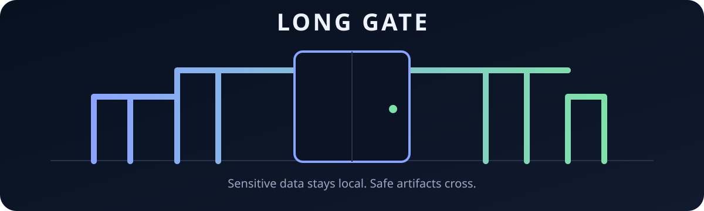
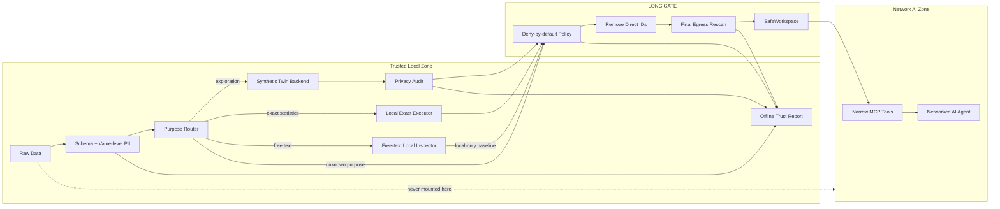

<div align="center">



# Long Gate

### Let AI reason about sensitive data without giving AI the sensitive data.

**A local-first privacy gateway and capability boundary for AI agents.**

[](https://github.com/CochraneK/long-gate/actions/workflows/test.yml)
[](https://github.com/CochraneK/long-gate/actions/workflows/security.yml)
[](https://github.com/CochraneK/long-gate/actions/workflows/security-audit.yml)
[](https://github.com/CochraneK/long-gate/actions/workflows/benchmarks.yml)
[](LICENSE)
[](pyproject.toml)
[](ROADMAP.md)

**[简体中文](README.zh-CN.md) · [FAQ](docs/faq.md) · [Getting Started](docs/getting-started.md) · [Quick start](#quick-start) · [Architecture](#architecture) · [Threat model](docs/threat-model.md) · [Benchmarks](docs/benchmarks.md) · [Roadmap](ROADMAP.md) · [Contributing](CONTRIBUTING.md)**

</div>

---

## The 30-second version

Most AI integrations protect sensitive data with instructions:

> “The agent can access the file, but please don't reveal it.”

Long Gate takes a different position:

> **If a networked AI should not see raw data, do not give it the capability to see raw data.**

Long Gate sits between private local datasets and networked AI systems. It inspects data locally, routes each task to the minimum necessary representation, runs exact statistics locally when needed, and exposes only policy-approved artifacts through a narrow safe workspace.

```text
PRIVATE / LOCAL                                   NETWORKED AI

Raw data
   │
   ├── schema question ───────────────► metadata only
   │
   ├── exploration ─► synthetic twin ─► privacy audit ─┐
   │                                                    │
   └── exact analysis ─► local executor ─► aggregates ──┤
                                                        ▼
                                                ┌──────────────┐
                                                │  LONG GATE   │
                                                │ egress guard │
                                                └──────┬───────┘
                                                       │
                                                  safe artifacts
                                                       │
                                                       ▼
                                                   AI agent
```

**Raw and pseudonymized row-level data are network-ineligible by policy.**

> Long Gate is currently pre-1.0. Row-level synthetic egress remains fail-closed by default while stronger privacy validation is being hardened.

---

## Why this exists

AI agents are getting very good at analysis, coding, interpretation, and research. The obvious integration pattern is to mount a folder, connect an API, and let the agent work.

That pattern becomes dangerous when the folder contains:

- research participants;
- mental-health or clinical variables;
- employee or student records;
- interviews and narratives;
- longitudinal identifiers;
- internal business data;
- any dataset where “remove the name column” is not enough.

Long Gate is built around one architectural invariant:

> **Anything that can read raw data should not have unrestricted network access. Anything that has network access should not receive raw-data capabilities.**

That is a system boundary, not a prompt.

---

## What makes Long Gate different

| Common approach | What it does well | What Long Gate adds |
|---|---|---|
| **Mask / pseudonymize IDs** | Hides obvious identity strings | Pseudonymized rows stay local; frequency/linkage structure is treated as sensitive |
| **PII redaction** | Finds names, emails, phones, IDs | PII scanning is one layer, not the whole release policy |
| **Synthetic data** | Produces useful surrogate rows | Generation is wrapped in overlap/linkage audits, policy, identifier stripping, and egress rescanning |
| **Differential privacy** | Can provide formal guarantees | DP-capable engines can be plugged in without defining the whole architecture |
| **Prompt guardrails** | Easy to add | Long Gate removes capabilities instead of relying on compliance |
| **Secure sandbox** | Isolates processes | Long Gate also decides *what representation* the AI is allowed to receive |

Long Gate does **not** try to replace mature synthetic-data, PII, or statistical libraries.

Its job is the missing control plane around them:

**purpose → representation → local computation → privacy audit → egress policy → safe capability → provenance**

See [How Long Gate differs](docs/comparison.md).

---

## Architecture



The hardened deployment mirrors the same rule at process level:

- **local worker** → private mount + `network_mode: none`
- **network worker** → network capability + safe read-only mount
- no worker gets both capabilities

See [Architecture](docs/architecture.md) and [Agent boundary](docs/agent-boundary.md).

---

## A concrete example

Imagine this source table exists only on your machine:

```text
name      phone          age   PHQ   reaction_time   group
Alice     +44...          23    15       612          A
...
```

A weak privacy layer might produce:

```text
P001      PHONE001        23    15       612          A
```

The identity strings changed, but the row is still effectively the same person.

Long Gate is designed for a stronger workflow:

1. identify direct and quasi-identifiers locally;
2. exclude direct identifiers from supported synthetic-model training;
3. generate surrogate structure locally;
4. test for exact-row, identifier, near-copy, and rare quasi-identifier overlap;
5. remove direct identifier columns from the outbound row view;
6. run a final value-level PII scan;
7. expose only the approved artifact;
8. keep an offline audit trail showing what happened.

For exact inference, Long Gate does something different:

```text
AI proposes analysis
        ↓
real data stays local
        ↓
local exact executor
        ↓
β / SE / CI / p / N / R²
        ↓
aggregate guard
        ↓
AI interprets safe result
```

Synthetic data is for **exploration and planning**. Official statistics can stay exact and local.

---

## Quick start

### 1. Install

```bash
git clone https://github.com/CochraneK/long-gate.git
cd long-gate

python -m venv .venv
source .venv/bin/activate      # Windows: .venv\Scripts\activate

pip install -e .
```

### 2. See what your machine can do

```bash
longgate doctor
```

### 3. Inspect locally

```bash
longgate inspect examples/demo.csv
```

The output contains schema and PII **counts**, not matched private values.

### 4. Run the privacy pipeline

```bash
longgate run examples/demo.csv --backend auto
```

`auto` prefers an installed mature local backend and otherwise falls back to the demo backend.

The demo backend is intentionally **never eligible for row-level egress**. Long Gate now continues through a release ladder: when row-level synthetic output is rejected, it attempts a guarded aggregate fallback instead of ending at `BLOCKED`. If even aggregate disclosure is not justified, the run stays `LOCAL_ONLY` with explicit next actions.


---

## Local AI with one setup command

You do **not** need to understand GGUF quantization before using Long Gate.

```bash
pip install -e '.[models,local-llm]'
longgate model setup
```

That one command detects system RAM, picks a curated model, downloads an immutable upstream revision, verifies SHA-256, and stores it as the Model Vault default.

Then private processing is simply:

```bash
longgate semantic-transform-local interview.txt \
  --model auto \
  --out preview.txt
```

`auto` only resolves the already-installed verified default model; it does not download anything.

The built-in catalog starts with official Qwen3 Q4_K_M GGUF releases:

| Machine RAM | Long Gate default | Model file |
|---:|---|---:|
| ~8 GB | `qwen3-4b` | ~2.5 GB |
| ~16 GB | `qwen3-8b` | ~5.03 GB |
| ~24 GB+ | `qwen3-14b` | ~9 GB |

Long Gate downloads models only in explicit **Model Setup Mode**, verifies the expected SHA-256, and stores them in the local Model Vault. The private-processing path resolves the local alias and never downloads a model.

Want your own AI to configure everything?

```bash
longgate setup-prompt
```

Copy the output into a coding assistant or computer-use agent. The maintained prompt tells it to install Long Gate and the recommended local model **without opening any private dataset**.

See [Local Model Guide](docs/models.md) and [AI setup prompt](docs/ai-setup-prompt.md).

---

## Optional engines

Install only the capabilities you need:

```bash
pip install -e '.[mostlyai]'   # local synthetic backend
pip install -e '.[synthcity]'  # local synthetic backend
pip install -e '.[presidio]'   # enhanced local PII analysis
pip install -e '.[stats]'      # local OLS/statistics
pip install -e '.[mcp]'        # safe-workspace MCP boundary
pip install -e '.[documents]'  # local DOCX/PDF text extraction
pip install -e '.[local-llm]'  # in-process local GGUF semantic preview
pip install -e '.[models]'     # curated Model Vault installer
```

Long Gate currently includes adapters for:

| Capability | Integration | Default row-level egress |
|---|---|---|
| Demo synthesis | built-in | row-level blocked → aggregate fallback |
| Synthetic data | SynthCity | row-level blocked in baseline → aggregate fallback |
| Synthetic data | MOSTLY AI local mode | row-level blocked in baseline → aggregate fallback |
| PII analysis | built-in local scanner | local only |
| PII analysis | Microsoft Presidio | local only |
| Exact statistics | pandas / statsmodels | guarded aggregate only |
| Free text | TXT / Markdown local inspection | **local only** |
| Documents | DOCX / PDF text-layer inspection | **local only** |
| Agent access | FastMCP | SafeWorkspace only |

---

## Privacy profiles: engineering presets, not certifications

Privacy thresholds should be reviewable and reproducible, not hidden in source code.

```bash
longgate profiles

longgate run study.csv --profile clinical
longgate exact study.csv describe --profile clinical
```

Built-in profiles currently include `research`, `clinical`, and `enterprise`.

**These are engineering presets, not certifications.** The `clinical` profile does not imply HIPAA, GDPR, NHS, medical-device, ethics-board, or other regulatory approval.

Every built-in profile still keeps row-level synthetic egress blocked by default.

See [Privacy profiles](docs/privacy-profiles.md).

---

## Purpose-bound disclosure

Different questions should not receive the same amount of data.

```bash
longgate purpose regression
```

Current routing philosophy:

| Purpose | Representation |
|---|---|
| “What columns exist?” | schema metadata |
| “Help me prototype an analysis” | synthetic path |
| “Show distributions” | synthetic path / safe summaries |
| “Compute the real regression” | exact local executor |
| free-text narrative | local-only inspection baseline |
| unknown / ambiguous purpose | local-only / clarify purpose |

Exact local examples:

```bash
longgate exact study.csv describe

longgate exact study.csv correlation

longgate exact study.csv group-summary \
  --group-by group \
  --value score

longgate exact study.csv ols \
  --outcome score \
  --predictor age \
  --predictor group

# Same guarded exact path, fixed local R template:
longgate exact study.csv ols \
  --engine r \
  --outcome score \
  --predictor age \
  --predictor group
```

Exact-stat release guards include:

- identifier exclusion;
- minimum dataset size;
- small-group suppression;
- rare categorical-level blocking;
- final aggregate PII scanning.

---

## Free text: local first, still fail-closed

Narratives can identify a person through **meaning**, even when names and phone numbers are removed.

Long Gate therefore refuses to call regex redaction “anonymous”.

```bash
longgate text-inspect interview.txt

longgate text-redact-local interview.txt \
  --out redacted-preview.txt
```

The second command is deliberately named `-local`: it creates a local preview, **not** a network-safe artifact.

DOCX and PDF text-layer inspection is also available locally:

```bash
longgate document-inspect report.docx
longgate document-inspect transcript.pdf
```

PDF inspection does **not** OCR scanned/image-only pages, so zero extracted hits never means the visible document is safe to upload.

An experimental local GGUF semantic preview is also available:

```bash
longgate semantic-transform-local interview.txt \
  --model /models/local-model.gguf \
  --out preview.txt
```

It writes a copy-risk audit sidecar and still records `release_allowed=false`.

See [Unstructured data](docs/unstructured.md) and [Local semantic preview](docs/semantic-preview.md).

---

## The Trust Report

Every run generates a self-contained offline HTML report.

```text
longgate-runs/LG-.../
├── manifest.json
├── audit.json
├── safe/
│   └── synthetic.csv
├── egress/
│   └── egress_manifest.json
└── report/
    └── trust-report.html
```

The report answers:

- **What stayed local?**
- **Which columns were treated as identifiers or sensitive?**
- **Which privacy attacks were checked?**
- **Were direct identifiers removed?**
- **Did the final egress scan pass?**
- **Did any network transmission occur?**
- **Which code/policy version produced this decision?**

It is deliberately offline: no CDN, analytics, remote fonts, or external assets.

Open the committed [Trust Report example](examples/trust-report-demo.html).

Each run also writes an integrity-verifiable `provenance.json` containing SHA-256 hashes of key artifacts.

```bash
longgate verify-run longgate-runs/LG-...
```

This detects post-run modification. It is intentionally described as **integrity verification, not a digital signature**. See [Provenance](docs/provenance.md).

---

## Agent boundary

The optional MCP server does **not** expose your filesystem.

It exposes only:

```text
gate_info()
list_safe_files(purpose)
read_safe_text(relative_path, purpose)
```

Network-facing reads additionally require a **local hash-bound approval** for the exact relative path, SHA-256, and declared purpose. The MCP surface cannot create approvals.

The `SafeWorkspace` rejects:

- absolute paths;
- `../` traversal;
- resolved paths that escape the approved root.

There is intentionally no:

- arbitrary shell tool;
- arbitrary Python tool;
- raw-file path tool;
- “force release” tool.

```bash
pip install -e '.[mcp]'

export LONGGATE_SAFE_WORKSPACE=/path/to/approved/egress
export LONGGATE_APPROVAL_LEDGER=/path/to/approvals.jsonl
export LONGGATE_ACCESS_LOG=/path/to/access.jsonl
longgate-mcp
```

---

## Security invariants

Long Gate treats security promises as executable requirements.

A few examples:

```text
RAW rows                 → NEVER network eligible
PSEUDONYMIZED rows       → NEVER network eligible
UNKNOWN purpose          → BLOCK
PII found at final scan  → BLOCK
demo backend             → BLOCK
free text                → LOCAL ONLY baseline
small unsafe group       → SUPPRESS / BLOCK
path escapes safe root   → BLOCK
```

CI includes:

- unit + privacy invariant tests;
- synthetic adversarial benchmark smoke tests;
- CodeQL;
- Bandit;
- pip-audit;
- Trivy;
- CycloneDX SBOM generation;
- Dependabot.

See the full [Security invariants](docs/security-invariants.md) and [Threat model](docs/threat-model.md).

If you find a vulnerability, **do not attach real sensitive data to a public issue**. Follow [SECURITY.md](SECURITY.md).

---

## Adversarial benchmarks

Long Gate ships a synthetic benchmark fixture so privacy checks can be tested against deliberate failures rather than only happy paths.

```bash
python benchmarks/generate_adversarial.py
python benchmarks/run_privacy_benchmark.py
python benchmarks/run_k_anonymity_benchmark.py
python benchmarks/run_membership_benchmark.py
python benchmarks/run_linkage_benchmark.py
```

The current adversarial suite now includes:

- exact-copy and identifier-overlap checks;
- numeric near-copy diagnostics;
- rare quasi-identifier overlap checks;
- k-anonymity-style equivalence-class summaries;
- a transparent distance-based membership diagnostic;
- exact auxiliary-data linkage diagnostics.

The project deliberately does **not** collapse these into a single magic “privacy score”.

A benchmark pass is **evidence for a defined test**, not an anonymity certificate.

See [Benchmarks](docs/benchmarks.md).

---

## Current status

Long Gate is deliberately conservative.

### Implemented baseline

- [x] structured CSV / XLSX / JSON / Parquet ingest
- [x] schema + value-level PII inspection
- [x] Presidio integration
- [x] SynthCity / MOSTLY AI local adapters
- [x] exact-row / identifier / near-copy / rare quasi-ID checks
- [x] k-anonymity-style / membership / auxiliary-linkage diagnostics
- [x] attribute-inference + longitudinal-linkage diagnostics
- [x] purpose-bound disclosure
- [x] local Python exact statistics
- [x] fixed-template local R describe / OLS
- [x] aggregate guard
- [x] non-dead-end release ladder (synthetic → aggregate → local-only)
- [x] research / clinical / enterprise engineering privacy profiles
- [x] SafeWorkspace + narrow FastMCP surface
- [x] hardened local/network process boundary examples
- [x] hash-bound egress approval ledger + network access log
- [x] SHA-256 provenance + verification
- [x] TXT / Markdown / DOCX / PDF local inspection
- [x] local GGUF semantic preview + copy-risk audit
- [x] curated Model Vault with RAM-aware one-command setup
- [x] pinned model revision + SHA-256 verification
- [x] copyable AI setup prompt
- [x] adversarial benchmark CI
- [x] offline Trust Report
- [x] build / clean-install release readiness

### Still being hardened

- [ ] production criteria for row-level synthetic egress
- [ ] stronger membership-inference / fuzzy-linkage variants
- [ ] semantic-safe unstructured release criteria
- [ ] organization-defined policy/profile files
- [ ] key-backed digital signatures / attestation
- [ ] scanned-PDF OCR, image, and audio privacy paths
- [x] outbound network-agent request ledger / approval protocol
- [ ] broader adversarial red-team corpus

See the [Roadmap](ROADMAP.md).

---

## What Long Gate does **not** claim

Long Gate does not currently claim:

- that synthetic data is automatically anonymous;
- a formal differential-privacy guarantee from the orchestration layer itself;
- legal or regulatory compliance certification;
- production certification for row-level synthetic egress;
- protection against a compromised host OS or administrator;
- semantic privacy guarantees for arbitrary free text, images, audio, or PDFs.

Those boundaries are features, not footnotes. Security tooling becomes less trustworthy when it hides its assumptions.

---

## Designed for integration

Long Gate is intended to sit underneath other projects.

```python
from longgate import LongGate

gate = LongGate()

inspection = gate.inspect("study.csv")
decision = gate.route("regression")

result = gate.exact(
    "study.csv",
    "ols",
    outcome="score",
    predictors=["age", "group"],
)
```

The goal is for downstream applications to call **Long Gate**, not cloud AI APIs directly, when sensitive local data is involved.

---

## Project philosophy

Three rules guide development:

1. **Capabilities beat prompts.**  
   If the agent must not read raw data, remove raw-data access.

2. **Purpose determines disclosure.**  
   A schema question should not receive rows. Exact statistics should not require cloud access to the source table.

3. **Integrate mature privacy tech; don't reinvent it.**  
   Long Gate should own orchestration, trust boundaries, policy, egress, provenance, and agent permissions — not reimplement every PII detector or synthetic model.

Read the longer [Vision](docs/vision.md).

---

## Contributing

Long Gate especially welcomes contributions in:

- privacy attacks and evaluation;
- synthetic-data adapters;
- differential-privacy backends;
- local execution sandboxes;
- Chinese / multilingual PII detection;
- threat modeling;
- adversarial tests;
- Trust Report UX;
- research reproducibility.

Start with [CONTRIBUTING.md](CONTRIBUTING.md).

For a privacy design concern, use the dedicated **Privacy / threat-model review** issue template.

---

## Research use

If you use Long Gate in research, please cite the repository using [CITATION.cff](CITATION.cff).

Long Gate records input hashes, policy decisions, backend names, audit outcomes, and run provenance so privacy processing can become part of the reproducible research record.

---

## Documentation

Start with [docs/index.md](docs/index.md).

- [Getting Started](docs/getting-started.md)
- [Troubleshooting](docs/troubleshooting.md)
- [Vision](docs/vision.md)
- [Architecture](docs/architecture.md)
- [Comparison](docs/comparison.md)
- [Threat model](docs/threat-model.md)
- [Security invariants](docs/security-invariants.md)
- [Agent boundary](docs/agent-boundary.md)
- [Egress approval ledger](docs/approval-ledger.md)
- [Unstructured data](docs/unstructured.md)
- [Benchmarks](docs/benchmarks.md)
- [Privacy profiles](docs/privacy-profiles.md)
- [Organization policy files](docs/organization-policy.md)
- [Release ladder](docs/release-ladder.md)
- [Provenance](docs/provenance.md)
- [Local R executor](docs/r-executor.md)
- [Local semantic preview](docs/semantic-preview.md)
- [Local Model Guide](docs/models.md)
- [AI setup prompt](docs/ai-setup-prompt.md)

---

## License

Long Gate's own code is licensed under **Apache-2.0**.

Third-party libraries retain their respective licenses. See [THIRD_PARTY_NOTICES.md](THIRD_PARTY_NOTICES.md).

---

<div align="center">

### Build AI workflows where sensitive data has a boundary.

If that is a problem you care about, **⭐ star Long Gate** and help pressure-test the threat model.

</div>
