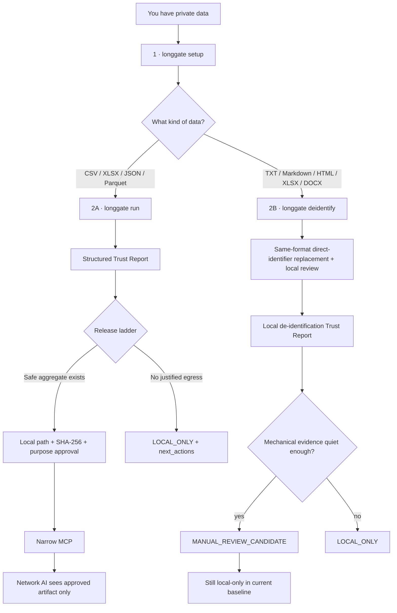
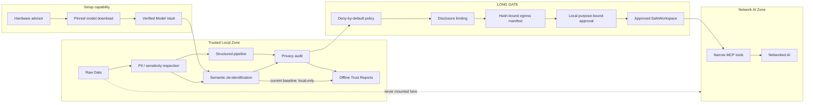

<div align="center">


# Long Gate

### Let AI reason about sensitive data without giving AI the sensitive data.

**A local-first privacy gateway and capability boundary for AI agents.**

[](https://github.com/CochraneK/long-gate/actions/workflows/test.yml)
[](https://github.com/CochraneK/long-gate/actions/workflows/security.yml)
[](https://github.com/CochraneK/long-gate/actions/workflows/security-audit.yml)
[](https://github.com/CochraneK/long-gate/actions/workflows/benchmarks.yml)
[](LICENSE)
[](pyproject.toml)
[](ROADMAP.md)

**[简体中文](README.zh-CN.md) · [5-minute guide](docs/getting-started.md) · [FAQ](docs/faq.md) · [Threat model](docs/threat-model.md) · [Roadmap](ROADMAP.md)**

</div>

---

## The 30-second version

Most AI integrations protect private data with instructions:

> “The agent can access the file, but please don't reveal it.”

Long Gate takes a different position:

> **If a networked AI should not see raw data, do not give it the capability to see raw data.**

Long Gate keeps private data local, chooses the minimum useful representation, runs exact computation or semantic transformation locally, audits the result, and exposes only explicitly supported artifacts through a narrow approval boundary.

**Raw and pseudonymized row-level data are network-ineligible. Row-level synthetic egress remains fail-closed in the current pre-1.0 baseline. Semantic de-identification output also remains local-only.**

---

# Start here

Install the capabilities for local model setup and document de-identification:

```bash
git clone https://github.com/CochraneK/long-gate.git
cd long-gate

python -m venv .venv
source .venv/bin/activate      # Windows: .venv\Scripts\activate
pip install -e '.[models,documents]'
```

`local-llm` is optional because `llama-cpp-python` contains native C++ code.
On Windows, Python 3.12 plus the upstream CPU wheel is usually the quickest
route. Install it after the core CLI works:

```powershell
pip install -e ".[local-llm]"
pip install llama-cpp-python --extra-index-url https://abetlen.github.io/llama-cpp-python/whl/cpu
```

Run `longgate doctor` to see the detected reason and next installation step.

Then:

```bash
longgate setup --recommend-only
```

Long Gate locally inspects the machine and recommends a model without downloading anything.

When ready:

```bash
longgate setup
```

That performs:

```text
local hardware inspection
        ↓
RAM-led model recommendation
        ↓
pinned model download
        ↓
SHA-256 verification
        ↓
Model Vault default
        ↓
READY
```

Setup Mode may use the network, but should not have private data mounted or opened.

---

# The real user journey



The central rule is:

> **Processing success is not release authorization.**

---

## Which command should I use?

| Goal | Start here |
|---|---|
| Detect hardware and get local-model guidance | `longgate hardware` |
| Configure the recommended verified model | `longgate setup` |
| Inspect installed capabilities | `longgate doctor` |
| Run structured privacy workflow | `longgate run study.csv --profile research` |
| Compute real statistics locally | `longgate exact study.csv ...` |
| Create a same-format TXT/Markdown/HTML/XLSX/DOCX de-identified copy | `longgate deidentify interview.md` |
| Create a strongly abstracted local semantic summary | `longgate semantic-summarize interview.txt --model auto --out summary.txt` |
| Inspect DOCX/PDF without an LLM | `longgate document-inspect ...` |
| Local image/scanned-PDF OCR | `image-ocr-local` / `pdf-ocr-local` |
| Let a network AI read a supported safe aggregate | `run` → review → `approve-egress` → `longgate-mcp` |
| Let another coding AI configure Setup Mode | `longgate setup-prompt` |

---

# Hardware-aware local AI setup

`longgate hardware` is local-only:

```bash
longgate hardware
```

It reports, when available:

- operating system and architecture;
- logical CPU count;
- system RAM;
- free disk space for the Model Vault;
- NVIDIA GPU and VRAM via local `nvidia-smi`;
- FAST / BALANCED / QUALITY model fit.

Current curated tiers:

| Tier | Model | Typical role |
|---|---|---|
| FAST | `qwen3-4b` Q4_K_M | lighter / faster local transform |
| BALANCED | `qwen3-8b` Q4_K_M | mid-memory balance |
| QUALITY | `qwen3-14b` Q4_K_M | higher-capacity semantic transform |

The selected default remains RAM-led and conservative. GPU information is advisory because actual offload depends on the local llama.cpp build.

If GPU detection fails, Long Gate does **not** call a remote hardware service and does not block CPU-only use.

Advanced model commands remain available:

```bash
longgate model recommend
longgate model setup
longgate model verify auto
longgate model list
```

See [Local Model Guide](docs/models.md).

---

# Path A · private structured data

Inspect first:

```bash
longgate inspect study.csv
```

Run the full pipeline:

```bash
longgate run study.csv --profile research --backend auto
```

The structured release ladder is:

```text
row-level synthetic
      ↓ blocked / pre-1.0 hard-lock
disclosure-limited aggregate
      ↓ if still not justified
LOCAL_ONLY + next_actions
```

A rejected row-level representation is not a dead end, but Long Gate does not weaken privacy policy merely to produce something.

For real statistics:

```bash
longgate exact study.csv describe
longgate exact study.csv correlation
longgate exact study.csv group-summary --group-by group --value score
longgate exact study.csv ols --outcome score --predictor age --predictor group
```

The source rows stay local.

---

# Path B · private text: preserve first, abstract when needed

Long Gate now separates two different privacy tasks instead of pretending they are the same thing.

### B1 · Format-preserving TXT / Markdown / HTML / XLSX / DOCX copy

```bash
longgate deidentify interview.md
```

Default output:

```text
interview.deidentified.md
interview.deidentified.md.audit.json
interview.deidentified.md.trust-report.html
```

`deidentify` keeps the supported document structure and replaces explicit direct identifiers with stable document-scoped placeholders such as `[EMAIL_001]` and `[PHONE_001]`. TXT/Markdown keeps text structure; HTML preserves DOM/tag structure while processing visible text and selected attributes; XLSX traverses all worksheets including hidden sheets plus comments, links, and selected workbook properties; DOCX rewrites OOXML text nodes across body/tables/headers/footers/comments/footnotes/endnotes, including identifiers split across Word runs. It never overwrites the source file, fixes the source SHA-256 before any write, and uses atomic output replacement.

Names, organizations, locations, aliases, rare events, and combination-uniqueness risks still require review. HTML scripts/styles/templates/SVG text and XLSX formulas/sheet titles/defined names are intentionally not silently rewritten; direct PII remaining there forces `LOCAL_ONLY`. Every result keeps `release_allowed = false`.

DOCX images/embedded objects/ActiveX/custom XML remain unresolved surfaces and force `LOCAL_ONLY`; direct PII in unmodified relationship/field instructions also forces `LOCAL_ONLY`. PDF format-preserving rewrite remains unsupported and fails closed.

### B2 · Strong semantic abstraction

If the goal is to produce an identity-detached abstract summary rather than a reusable same-format copy, use:

```bash
longgate semantic-summarize interview.txt \
  --model auto \
  --out summary.txt
```

This retains the previous local-GGUF pipeline:

```text
original private document
        ↓
deterministic local pre-scrub
        ↓
verified local GGUF model
        ↓
identity-detached semantic abstraction
        ↓
audit candidate against ORIGINAL source
        ↓
bounded remediation, maximum 3 rounds
        ↓
MANUAL_REVIEW_CANDIDATE or LOCAL_ONLY
```

Truncated local-model completions are rejected rather than accepted as partial privacy transforms. Semantic output remains local-only and never becomes network-authorized automatically.

Run a deeper local model check when needed:

```bash
longgate doctor --deep --model auto
```

See [Local semantic privacy path](docs/semantic-preview.md).

---
# Mechanical semantic evidence

Current `semantic-release-evidence-v1` thresholds for becoming eligible for local human review are:

- direct PII hits = 0;
- reused exact numeric tokens = 0;
- normalized character n-gram reuse ≤ 1%;
- distinctive long-token reuse ≤ 5%;
- transformed output length ≥ 80 characters.

These tests are useful evidence, not proof that outside knowledge cannot re-identify someone.

Still-open research includes:

- rare-event leakage;
- relationship leakage;
- combination uniqueness;
- multilingual semantic attacks;
- privacy-aware long-document segmentation and cross-chunk audits;
- stronger auxiliary-data linkage evaluation.

---

# Let a networked AI read a supported safe result

This path currently applies to supported structured egress artifacts such as a disclosure-limited aggregate — **not semantic text output**.

Suppose a structured run produced:

```text
longgate-runs/LG-123/egress/safe_aggregate.json
```

Review its Trust Report, then approve the exact artifact locally:

```bash
longgate approve-egress \
  longgate-runs/LG-123/egress/safe_aggregate.json \
  --workspace longgate-runs/LG-123/egress \
  --ledger ./longgate-policy/approvals.jsonl \
  --purpose "interpret aggregate statistics"
```

Approval requires a matching Long Gate egress manifest proving:

- policy `allow = true`;
- final scan passed;
- supported aggregate release class;
- exact artifact filename;
- exact artifact SHA-256.

The approval additionally binds:

```text
relative path + SHA-256 + exact purpose
```

An arbitrary file copied into the workspace cannot be approved. Modifying an approved artifact invalidates the hash match.

Start the narrow MCP boundary:

```bash
pip install -e '.[mcp]'

export LONGGATE_SAFE_WORKSPACE=/absolute/path/to/longgate-runs/LG-123/egress
export LONGGATE_APPROVAL_LEDGER=/absolute/path/to/longgate-policy/approvals.jsonl
export LONGGATE_ACCESS_LOG=/absolute/path/to/longgate-policy/access.jsonl
longgate-mcp
```

The network-facing surface intentionally exposes only:

```text
gate_info()
list_safe_files(purpose)
read_safe_text(relative_path, purpose)
```

There is no MCP tool for arbitrary local filesystem browsing, arbitrary shell/Python, approval creation, or force release.

---

# Model setup vs private processing

Long Gate separates the capabilities deliberately:

```text
MODEL SETUP MODE
Internet: YES
Private data: NO
Model Vault: WRITE
        ↓
PRIVATE PROCESSING MODE
Internet: NO
Private data: YES
Model Vault: READ ONLY
```

The unsafe combination is a process that can both read raw private data and use unrestricted network access.

Private semantic processing resolves an already-installed verified GGUF model and performs no model download.

---

# Other local-only media paths

```bash
pip install -e '.[documents,media,ocr]'

longgate document-inspect report.docx
longgate document-inspect transcript.pdf
longgate image-inspect photo.jpg
longgate image-ocr-local scan.png
longgate pdf-ocr-local scanned.pdf --max-pages 50
longgate audio-inspect interview.wav
```

OCR has no cloud fallback. These paths do not grant network egress.

---

# Architecture



The hardened deployment mirrors the same rule at process level:

- setup worker → network + Model Vault write, no private mount;
- private worker → private data + Model Vault read-only, no network;
- network worker → network + approved safe read-only workspace;
- privacy-boundary services drop Linux capabilities and enable `no-new-privileges`.

---

# Trust and provenance

Every structured run writes an offline Trust Report and SHA-256 provenance.

```bash
longgate verify-run longgate-runs/LG-...
```

Optional Ed25519 provenance signatures are available:

```bash
longgate sign-run longgate-runs/LG-... \
  --signing-key /secure/location/signing-key.pem
```

Unsigned provenance proves internal consistency only. Authenticated provenance still depends on **independently trusting the public key** used for verification.

---

# Privacy profiles

```bash
longgate profiles
longgate run study.csv --profile research
longgate run study.csv --profile clinical
longgate run study.csv --profile enterprise
```

These are engineering presets, **not certifications**.

`clinical` does not imply HIPAA, GDPR, NHS, medical-device, ethics-board, or other regulatory approval.

---

# Security posture

Executable invariants include:

```text
RAW rows                         → NEVER network eligible
PSEUDONYMIZED rows               → NEVER network eligible
ROW-LEVEL synthetic              → pre-1.0 HARD LOCK
semantic de-identification       → LOCAL ONLY baseline
semantic retries                 → max 3 rounds
semantic Trust Report            → no narrative content embedded
UNKNOWN purpose                  → BLOCK
PII at final structured scan     → BLOCK
arbitrary file in /egress        → CANNOT be approved
artifact changed after approval  → approval no longer matches
path / symlink escape            → BLOCK
hardware detection failure       → no remote fallback
```

CI includes unit/invariant tests, security-boundary tests, adversarial benchmarks, Bandit, Ruff security rules, `pip-audit`, Trivy, CycloneDX SBOM generation, and Dependabot.

Read [Security invariants](docs/security-invariants.md) and [Threat model](docs/threat-model.md).

---

# Optional engines

```bash
pip install -e '.[mostlyai]'     # local synthetic backend
pip install -e '.[synthcity]'    # local synthetic backend
pip install -e '.[presidio]'     # enhanced local PII analysis
pip install -e '.[stats]'        # local OLS/statistics
pip install -e '.[mcp]'          # narrow SafeWorkspace MCP
pip install -e '.[documents]'    # local DOCX/PDF extraction
pip install -e '.[models]'       # curated Model Vault setup
pip install -e '.[local-llm]'    # in-process local GGUF
pip install -e '.[media]'        # image metadata inspection
pip install -e '.[ocr]'          # local image/scanned-PDF OCR
pip install -e '.[attestation]'  # optional Ed25519 signatures
```

---

# What Long Gate does not claim

Long Gate does **not** currently claim:

- that synthetic data is automatically anonymous;
- that semantic de-identification is automatically anonymous;
- a formal differential-privacy guarantee from the orchestration layer itself;
- HIPAA / GDPR / NHS or other legal compliance certification;
- production certification for row-level synthetic egress;
- semantic privacy guarantees for arbitrary text, image, audio, or PDF content;
- protection against a compromised host OS or administrator.

Those boundaries are intentional.

---

# Current status

Implemented baseline includes:

- structured privacy pipeline and non-dead-end release ladder;
- disclosure-limited aggregate fallback;
- exact local Python/R computation;
- privacy profiles and organization policy files;
- local synthetic backends and adversarial privacy diagnostics;
- hardware-aware local model setup;
- curated pinned GGUF Model Vault;
- bounded iterative semantic de-identification;
- Semantic Trust Report;
- local document/image/OCR/audio paths;
- hash-bound structured egress manifests and approvals;
- SafeWorkspace + narrow MCP surface;
- SHA-256 and optional Ed25519 provenance;
- offline Trust Reports and security CI.

Still being hardened:

- larger semantic rare-event / relationship / multilingual attack corpus;
- privacy-aware long-document semantic processing;
- stronger DP-backend evaluation;
- evidence for any future row-level or semantic egress policy.

See [Roadmap](ROADMAP.md).

---

# Documentation

- [Getting Started — 5 minutes](docs/getting-started.md)
- [Format-preserving de-identification](docs/format-preserving.md)
- [Local semantic privacy path](docs/semantic-preview.md)
- [Local Model Guide](docs/models.md)
- [Threat model](docs/threat-model.md)
- [Security invariants](docs/security-invariants.md)
- [Agent boundary](docs/agent-boundary.md)
- [Egress approval ledger](docs/approval-ledger.md)
- [Release ladder](docs/release-ladder.md)
- [Privacy profiles](docs/privacy-profiles.md)
- [Provenance](docs/provenance.md)
- [Benchmarks](docs/benchmarks.md)
- [Troubleshooting](docs/troubleshooting.md)
- [Contributing](CONTRIBUTING.md)

---

# Project philosophy

1. **Capabilities beat prompts.** If the agent must not read raw data, remove raw-data access.
2. **Purpose determines disclosure.** A schema question should not receive rows.
3. **Evidence is not authorization.** Passing a privacy test does not create network permission.
4. **Blocked should lead somewhere safer.** Remediate or move down the disclosure ladder; never silently weaken policy.
5. **Local AI is a transformer, not the privacy authority.** Audit its output independently.
6. **Integrate mature privacy technology; do not reinvent it.** Long Gate owns orchestration, boundaries, policy, egress, provenance, and permissions.

---

# License

Long Gate's own code is licensed under **Apache-2.0**.

Third-party libraries retain their respective licenses. See [THIRD_PARTY_NOTICES.md](THIRD_PARTY_NOTICES.md).

---

<div align="center">

### Build AI workflows where sensitive data has a boundary.

</div>
