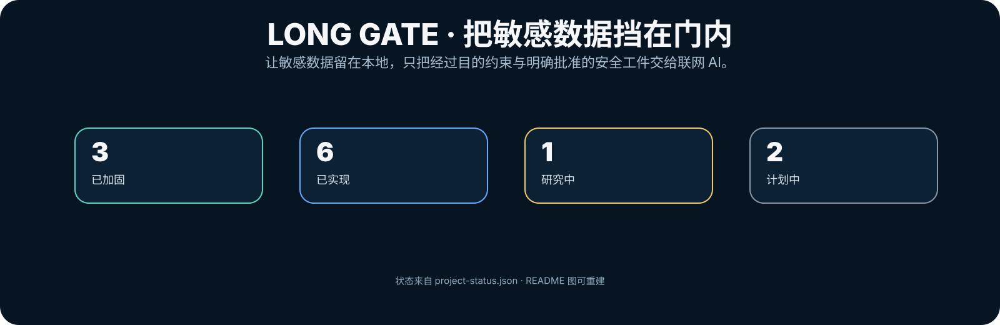
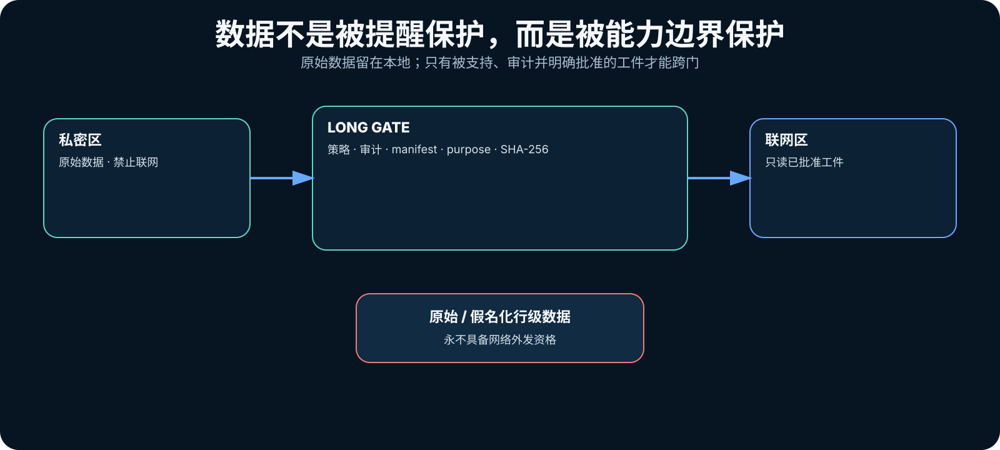
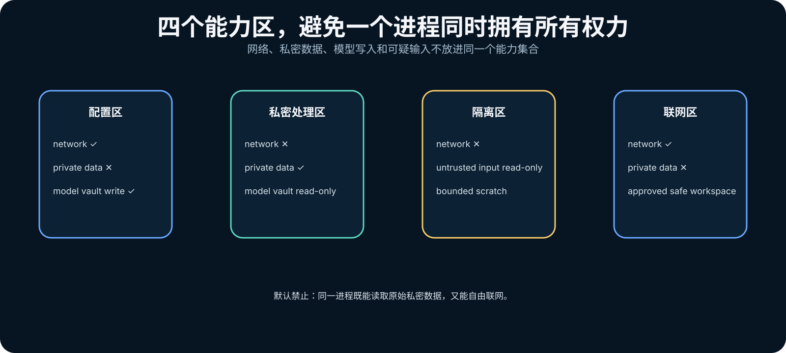
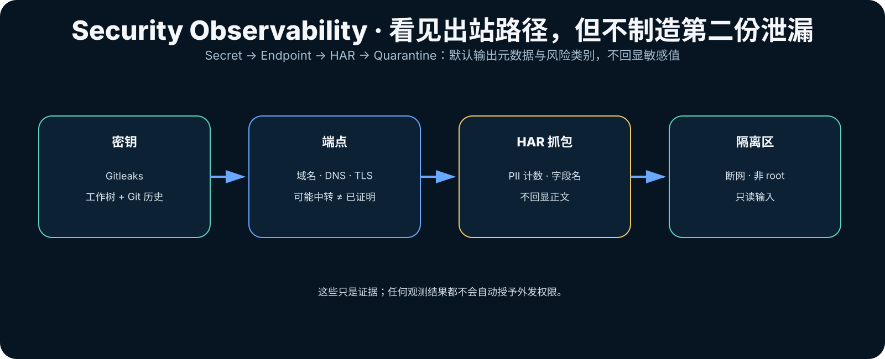
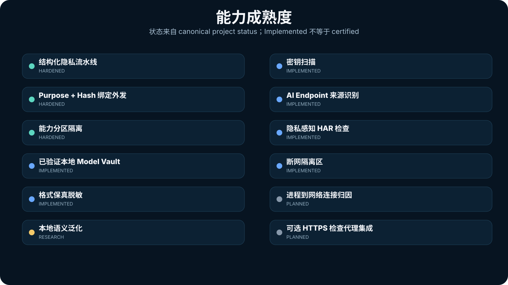
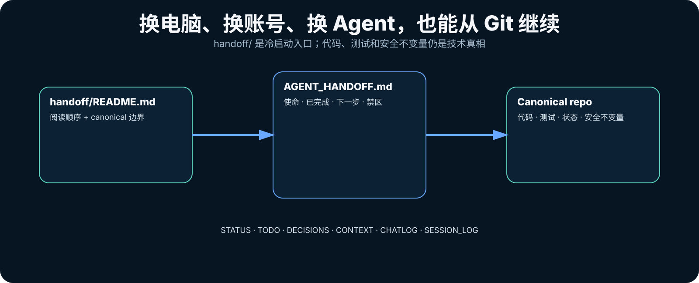

<p align="right">
  <a href="./README.en.md"></a>
  <a href="./README.md"></a>
</p>

<p align="center">
  
</p>

<p align="center">
  <a href="https://github.com/CochraneK/long-gate/actions/workflows/test.yml"></a>
  <a href="https://github.com/CochraneK/long-gate/actions/workflows/security-audit.yml"></a>
  <a href="https://github.com/CochraneK/long-gate/actions/workflows/benchmarks.yml"></a>
  
  
</p>

# Long Gate

**让 AI 使用敏感数据产生价值，而不是直接获得敏感数据。**

Long Gate 是一个面向 AI Agent / AI workflow 的 **local-first 隐私网关与能力边界**。它不把安全寄托在“请不要泄露”这类 prompt 上，而是尽量从能力层面切断危险组合：

> **如果联网 AI 不应该看到原始数据，就不要给它读取原始数据的能力。**

## 30 秒看懂

<p align="center">
  
</p>

当前 pre-1.0 基线：

| 数据 / 工件 | 网络资格 |
|---|---|
| 原始 row-level 数据 | **禁止** |
| Pseudonymized row-level 数据 | **禁止** |
| Row-level synthetic | **pre-1.0 hard lock** |
| Semantic de-identification 输出 | **LOCAL_ONLY** |
| 支持的 disclosure-limited structured aggregate | 通过 manifest + SHA-256 + purpose + 本地批准后才可外发 |

**Evidence ≠ Authorization。** 扫描通过、脱敏成功、风险较低，都不会自动创建网络权限。

## 从这里开始

| 我现在要做什么 | 入口 |
|---|---|
| 让 Long Gate 看机器配置、推荐本地模型 | `longgate hardware` |
| 配置并校验本地模型 | `longgate setup` |
| 处理 CSV / XLSX / JSON / Parquet | `longgate run study.csv` |
| 本地做真实统计，不上传原始行 | `longgate exact study.csv ...` |
| 做 TXT / Markdown / HTML / XLSX / DOCX 格式保真脱敏 | `longgate deidentify FILE` |
| 对一批文件保持稳定占位符 | `longgate deidentify-batch DIR --out-dir OUT` |
| 做本地语义泛化摘要 | `longgate semantic-summarize FILE --out summary.txt` |
| 扫描仓库里的 API key / secret | `longgate secrets scan . --history` |
| 看 AI endpoint 是官方、router 还是自定义端点 | `longgate endpoint inspect URL` |
| 分析浏览器 / 本地代理导出的 HAR | `longgate egress inspect-har capture.har` |
| 在断网隔离区检查可疑输入 | `docker compose -f docker-compose.quarantine.yml ...` |
| 让另一个 Agent / 账号 / 电脑接管项目 | 先读 [`handoff/README.md`](handoff/README.md) |

## 5 分钟开始

```bash
git clone https://github.com/CochraneK/long-gate.git
cd long-gate

python -m venv .venv
source .venv/bin/activate      # Windows: .venv\Scripts\activate

pip install -e '.[models,documents]'
longgate setup --recommend-only
longgate doctor
```

真正下载并校验推荐模型：

```bash
longgate setup
```

`local-llm` 是可选能力。Windows 上如果 `llama-cpp-python` 安装受阻，优先参考 [Local Model Guide](docs/models.md)。

## 能力区不是一锅端

<p align="center">
  
</p>

Long Gate 默认把能力拆开：

- **Setup**：可联网，可写 Model Vault，不给 private data；
- **Private**：可读 private data，只读 Model Vault，不联网；
- **Quarantine**：可读可疑输入，但默认断网、non-root、资源受限；
- **Network**：可联网，但只读经过批准的 SafeWorkspace。

Long Gate 真正避免的是：

> **同一个进程既能读取原始敏感数据，又能自由联网。**

## Security Observability

<p align="center">
  
</p>

### 密钥扫描

```bash
longgate secrets scan .
longgate secrets scan . --history
```

本地使用 Gitleaks。Long Gate 的用户侧结果只保留 finding 数量、文件和规则标识，不回显 secret value。CI 另有 blocking full-history scan。

### AI Endpoint / 中转识别基础

```bash
longgate endpoint inspect https://api.openai.com/v1
longgate endpoint inspect https://example-proxy.test/v1 --no-connect
```

Long Gate 可以结合 hostname、DNS、IP、TLS certificate 等证据判断你**实际连接到的 endpoint**。

但必须区分：

```text
看到自定义 endpoint
      ≠
证明它最终把请求转给了哪个模型厂商
```

因此未知 / 自定义 endpoint 只标记为 **relay-possible / unknown**，不会伪造确定性。

### 看发送给 AI 的信息类别

如果浏览器或显式配置的本地代理已经导出 HAR：

```bash
longgate egress inspect-har capture.har
```

报告可以显示 destination host、request body 大小、PII 计数、敏感 header/query **名称**等；默认不回显 Authorization value、cookie、query value、matched PII 或完整 request body。

### Quarantine

`docker-compose.quarantine.yml` 提供一个独立能力区：

```text
no network
non-root
read-only root
read-only input
drop ALL capabilities
no-new-privileges
blanked common AI/cloud credentials
bounded tmpfs / CPU / RAM / PID
```

它是受限分析区，不声称能抵御被攻陷的 kernel / container runtime / host administrator。

## 当前能力成熟度

<p align="center">
  
</p>

这里的状态来自 [`project-status.json`](project-status.json)。**Implemented / Hardened 不等于 compliance certification。**

当前重点后续项包括：

- process → socket / network attribution；
- 可选、明确 opt-in 的 HTTPS inspection proxy 集成；
- 更强 provider / ASN provenance；
- 多语言 rare-event / relationship semantic privacy red-team；
- stronger DP-backend evaluation。

详见 [Roadmap](ROADMAP.md)。

## BLOCKED 不应该是死路

Long Gate 的默认策略不是为了“必须给出结果”而降低隐私门槛，而是优先换成更安全的表示：

```text
row-level synthetic
        ↓ 不允许
disclosure-limited aggregate
        ↓ 仍不适合
LOCAL_ONLY + next_actions
```

**Blocked should lead somewhere safer — not around the gate.**

## 跨 Agent / 跨设备连续性

<p align="center">
  
</p>

Long Gate 把长期状态放进 Git，而不是押在某一个聊天框里：

```text
handoff/
├── README.md
├── STATUS.md
├── TODO.md
├── DECISIONS.md
├── CONTEXT.md
├── CHATLOG.md
├── AGENT_HANDOFF.md
└── SESSION_LOG.md
```

另一个 Agent 原则上从 [`handoff/README.md`](handoff/README.md) 开始即可。公开仓库里的 CHATLOG 是 **public-safe distilled history**，不是原始聊天 dump，也不会保存 credential、敏感 payload 或隐藏 chain-of-thought。

连续性规则见 [Long Gate Continuity Standard](LONG_GATE_CONTINUITY_STANDARD.md)。

## README 图如何重建

README 的核心图不是截图：

```bash
python tools/build_readme_assets.py
```

数据来源是 [`project-status.json`](project-status.json)。这样 capability 状态与公开展示可以沿着同一个 canonical state 演化。

## Provenance 与 privacy profiles

Long Gate 支持 **optional Ed25519 provenance**。SHA-256 provenance 可以证明当前 run 内部工件的一致性；**authenticated provenance** 只有在验证方 independently trust / **trusted public key** 的前提下，才能进一步支持来源认证。Long Gate 不替用户托管长期私钥。

`research` / `clinical` / `enterprise` privacy profiles 是工程阈值预设，**not certifications**；`clinical` 也不代表 HIPAA、GDPR、NHS、伦理审批或医疗器械认证。

## 安全边界与非承诺

Long Gate 当前**不声称**：

- synthetic data 自动匿名；
- semantic de-identification 自动匿名；
- orchestration layer 自带 formal differential privacy；
- HIPAA / GDPR / NHS 等合规认证；
- row-level synthetic 已可生产外发；
- 任意文本、图片、音频、PDF 都有语义匿名保证；
- 能抵御已经被攻陷的 host OS / administrator。

完整约束请读：

- [Security invariants](docs/security-invariants.md)
- [Threat model](docs/threat-model.md)
- [Security observability](docs/security-observability.md)
- [Agent boundary](docs/agent-boundary.md)
- [Egress approval ledger](docs/approval-ledger.md)
- [Getting Started](docs/getting-started.md)
- [Documentation index](docs/index.md)

## 项目原则

1. **Capabilities beat prompts.**
2. **Purpose determines disclosure.**
3. **Evidence is not authorization.**
4. **Blocked should lead somewhere safer.**
5. **Local AI is a transformer, not the privacy authority.**
6. **Integrate mature security/privacy technology instead of重复造轮子。**
7. **Git is the canonical long-term project state.**

---

Long Gate 自身代码使用 **Apache-2.0** License。
