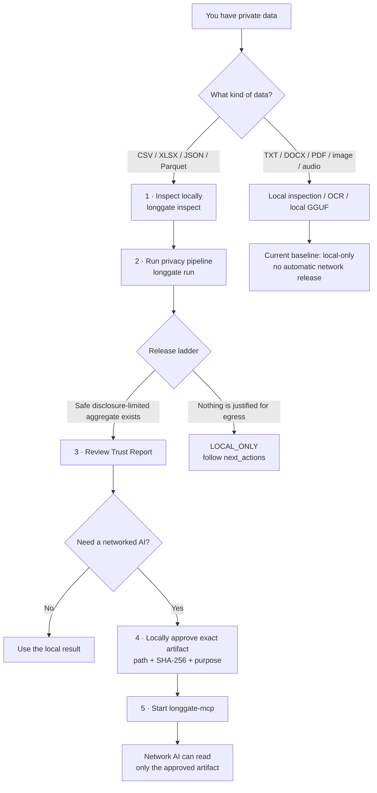
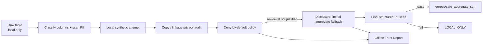
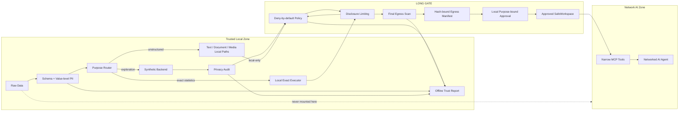

<div align="center">


# Long Gate

### Let AI reason about sensitive data without giving AI the sensitive data.

**A local-first privacy gateway and capability boundary for AI agents.**

[](https://github.com/CochraneK/long-gate/actions/workflows/test.yml)
[](https://github.com/CochraneK/long-gate/actions/workflows/security.yml)
[](https://github.com/CochraneK/long-gate/actions/workflows/security-audit.yml)
[](https://github.com/CochraneK/long-gate/actions/workflows/benchmarks.yml)
[](LICENSE)
[](pyproject.toml)
[](ROADMAP.md)

**[简体中文](README.zh-CN.md) · [5-minute guide](docs/getting-started.md) · [FAQ](docs/faq.md) · [Threat model](docs/threat-model.md) · [Benchmarks](docs/benchmarks.md) · [Roadmap](ROADMAP.md)**

</div>

---

## The 30-second version

Most AI integrations protect sensitive data with instructions:

> “The agent can access the file, but please don't reveal it.”

Long Gate takes a different position:

> **If a networked AI should not see raw data, do not give it the capability to see raw data.**

Long Gate keeps private data local, computes or transforms locally, and lets networked AI see only a narrower artifact that has passed policy, final scanning, and explicit local approval.

**Raw and pseudonymized row-level data are network-ineligible. Row-level synthetic egress is also hard-locked in the current pre-1.0 baseline.**

---

# How a real user uses Long Gate

This is the intended user journey.



The important point is that **“processing succeeded” and “AI may read this” are different decisions**.

Long Gate deliberately separates:

```text
local computation
      ↓
privacy / disclosure gate
      ↓
egress artifact
      ↓
human/local approval
      ↓
network-agent access
```

---

## Which command should I use?

| I want to... | Start here |
|---|---|
| See what Long Gate can do on this machine | `longgate doctor` |
| Inspect a table without releasing anything | `longgate inspect study.csv` |
| Run the full structured privacy workflow | `longgate run study.csv --profile research` |
| Compute real statistics locally | `longgate exact study.csv ...` |
| Let a network AI interpret an approved safe result | `longgate run` → review → `approve-egress` → `longgate-mcp` |
| Inspect TXT / Markdown / DOCX / PDF locally | `longgate document-inspect ...` |
| Run image or scanned-PDF OCR locally | `longgate image-ocr-local` / `pdf-ocr-local` |
| Inspect WAV metadata locally | `longgate audio-inspect` |
| Use a local LLM on private text | `longgate model setup` then `semantic-transform-local` |
| Let another coding AI configure Long Gate for you | `longgate setup-prompt` |

---

# First real workflow: a private table

Suppose you have:

```text
study.csv
```

and it contains participant, employee, student, clinical, or other sensitive data.

## 1. Install

```bash
git clone https://github.com/CochraneK/long-gate.git
cd long-gate

python -m venv .venv
source .venv/bin/activate      # Windows: .venv\Scripts\activate

pip install -e .
```

Then check the environment:

```bash
longgate doctor
```

## 2. Inspect the file locally

```bash
longgate inspect study.csv
```

Long Gate reports schema, classifications, and PII **counts**. It does not print matched private values as part of the inspection result.

Use this step to answer questions such as:

- Which columns look like identifiers?
- Which fields look sensitive or quasi-identifying?
- Did Long Gate misunderstand an important column?

## 3. Run the privacy pipeline

```bash
longgate run study.csv --profile research --backend auto
```

The command prints JSON similar to:

```json
{
  "run_id": "LG-...",
  "status": "...",
  "output": "longgate-runs/LG-...",
  "report": "longgate-runs/LG-.../report/trust-report.html",
  "release_class": "aggregate",
  "next_actions": [],
  "safe_payload": "longgate-runs/LG-.../egress/safe_aggregate.json"
}
```

The exact values depend on the data.

`auto` prefers an installed local synthetic backend and otherwise falls back to the built-in demo backend.

### What happens internally?



A rejected synthetic row-level representation is **not a dead end**. Long Gate moves down the disclosure ladder:

```text
row-level synthetic
        ↓ blocked / hard-locked
disclosure-limited aggregate
        ↓ if still unsafe
LOCAL_ONLY + next_actions
```

Long Gate does not weaken the policy just to produce something.

---

# Need the real statistics? Keep the real data local

Synthetic data is useful for exploration and planning. It is not required for official statistics.

Examples:

```bash
longgate exact study.csv describe

longgate exact study.csv correlation

longgate exact study.csv group-summary \
  --group-by group \
  --value score

longgate exact study.csv ols \
  --outcome score \
  --predictor age \
  --predictor group
```

Fixed-template local R is also supported:

```bash
longgate exact study.csv ols \
  --engine r \
  --outcome score \
  --predictor age \
  --predictor group
```

The raw rows remain local. Release guards include identifier exclusion, minimum dataset size, small-group suppression, rare categorical-level blocking, disclosure limiting, and final scanning.

---

# Let a networked AI read the safe result

This is the part that is easy to misunderstand.

**Do not upload `study.csv`. Do not mount the research folder into the network agent.**

Use the artifact produced in the run's `egress/` directory.

## 1. Review the Trust Report

Open the path printed in the `report` field, for example:

```text
longgate-runs/LG-.../report/trust-report.html
```

Check:

- what Long Gate classified as identifiers / sensitive fields;
- which release class was granted;
- why row-level output was blocked;
- whether aggregate fallback was used;
- whether the final egress scan passed;
- which artifact was staged.

## 2. Approve the exact staged artifact locally

If the run produced:

```text
longgate-runs/LG-123/egress/safe_aggregate.json
```

approve it for one explicit purpose:

```bash
longgate approve-egress \
  longgate-runs/LG-123/egress/safe_aggregate.json \
  --workspace longgate-runs/LG-123/egress \
  --ledger ./longgate-policy/approvals.jsonl \
  --purpose "interpret aggregate statistics"
```

Approval is bound to:

```text
Long Gate egress manifest
+ exact relative path
+ exact artifact SHA-256
+ exact purpose
```

The command refuses to approve an arbitrary file that was merely copied into the safe workspace. The artifact must be backed by a Long Gate egress manifest with:

- policy `allow = true`;
- successful final scan;
- matching artifact filename;
- matching artifact SHA-256;
- an allowed aggregate release class.

If the artifact changes after approval, the approval no longer matches.

## 3. Start the narrow MCP boundary

Install the optional MCP server:

```bash
pip install -e '.[mcp]'
```

macOS / Linux:

```bash
export LONGGATE_SAFE_WORKSPACE=/absolute/path/to/longgate-runs/LG-123/egress
export LONGGATE_APPROVAL_LEDGER=/absolute/path/to/longgate-policy/approvals.jsonl
export LONGGATE_ACCESS_LOG=/absolute/path/to/longgate-policy/access.jsonl

longgate-mcp
```

PowerShell:

```powershell
$env:LONGGATE_SAFE_WORKSPACE="C:\path\to\longgate-runs\LG-123\egress"
$env:LONGGATE_APPROVAL_LEDGER="C:\path\to\longgate-policy\approvals.jsonl"
$env:LONGGATE_ACCESS_LOG="C:\path\to\longgate-policy\access.jsonl"

longgate-mcp
```

Configure your MCP-compatible AI client to launch `longgate-mcp` with those environment variables.

The network-facing surface intentionally exposes only:

```text
gate_info()
list_safe_files(purpose)
read_safe_text(relative_path, purpose)
```

There is no network-facing tool to:

- read arbitrary local paths;
- browse your private dataset folder;
- create approvals;
- run arbitrary shell commands;
- run arbitrary Python against your files;
- bypass policy with a `--force-release` option.

The network AI receives only the approved artifact for the matching purpose.

See [Agent boundary](docs/agent-boundary.md) and [Egress approval ledger](docs/approval-ledger.md).

---

# Private documents, interviews, PDFs, images, and audio

Unstructured data can identify someone through meaning, not only obvious PII patterns. Long Gate therefore keeps these paths conservative.

Install the capabilities you need:

```bash
pip install -e '.[documents,media,ocr]'
```

Examples:

```bash
longgate document-inspect report.docx
longgate document-inspect transcript.pdf

longgate image-inspect photo.jpg
longgate image-ocr-local scan.png
longgate pdf-ocr-local scanned.pdf --max-pages 50

longgate audio-inspect interview.wav
```

OCR is local and has no cloud fallback.

These inspection paths do **not** grant network egress.

---

# Local LLM for private text

Model setup and private processing are intentionally separate capabilities.

```text
MODEL SETUP MODE
Internet: YES
Private data: NO
Model Vault: WRITE
        ↓
PRIVATE PROCESSING MODE
Internet: NO
Private data: YES
Model Vault: READ ONLY
```

Install:

```bash
pip install -e '.[models,local-llm]'
```

Then:

```bash
longgate model setup
longgate model verify auto
```

Long Gate detects available RAM, selects a curated GGUF model, downloads a pinned upstream revision, verifies the expected SHA-256, and stores it in the local Model Vault.

Current built-in guidance:

| Approx. system RAM | Default |
|---:|---|
| ~8 GB | `qwen3-4b` |
| ~16 GB | `qwen3-8b` |
| ~24 GB+ | `qwen3-14b` |

Private transformation:

```bash
longgate semantic-transform-local interview.txt \
  --model auto \
  --out preview.txt
```

`auto` resolves the already-installed verified local model. It does not download one during private processing.

The transformed text remains **local-only** in the current baseline. Mechanical checks can make it eligible for manual review, but they do not automatically prove semantic anonymity or authorize network release.

Want a coding agent to configure this without touching private files?

```bash
longgate setup-prompt
```

See [Local Model Guide](docs/models.md) and [AI setup prompt](docs/ai-setup-prompt.md).

---

# What files does a run create?

A structured run looks approximately like this:

```text
longgate-runs/LG-.../
├── manifest.json
├── audit.json
├── provenance.json
├── safe/
│   └── synthetic.csv
├── egress/
│   ├── aggregate_egress_manifest.json
│   └── safe_aggregate.json
└── report/
    └── trust-report.html
```

Depending on the decision, an egress payload may be absent.

The important directories are:

| Path | Meaning |
|---|---|
| `safe/` | local working/synthetic artifacts; not automatically network-approved |
| `egress/` | artifacts that survived the release pipeline |
| `report/` | offline explanation of the decision |
| `provenance.json` | hashes of key run artifacts |

Verify provenance:

```bash
longgate verify-run longgate-runs/LG-...
```

Optional Ed25519 signing:

```bash
longgate sign-run longgate-runs/LG-... \
  --signing-key /secure/location/signing-key.pem

longgate verify-run longgate-runs/LG-... \
  --public-key /trusted/location/public-key.pem
```

Unsigned provenance checks internal consistency only; authenticated origin requires a trusted public key.

---

# Architecture



The hardened deployment mirrors the same rule at process level:

- **local worker** → private mount + `network_mode: none`;
- **network worker** → network capability + approved safe read-only mount;
- privacy-boundary services drop Linux capabilities and enable `no-new-privileges`;
- no worker gets both raw-data and unrestricted network capability.

See [Architecture](docs/architecture.md).

---

# Privacy profiles

Built-in engineering presets:

```bash
longgate profiles

longgate run study.csv --profile research
longgate run study.csv --profile clinical
longgate run study.csv --profile enterprise
```

These are **engineering presets, not certifications**.

`clinical` does not mean HIPAA, GDPR, NHS, medical-device, ethics-board, or other regulatory approval.

See [Privacy profiles](docs/privacy-profiles.md).

---

# Optional engines

Install only what you need:

```bash
pip install -e '.[mostlyai]'    # local synthetic backend
pip install -e '.[synthcity]'   # local synthetic backend
pip install -e '.[presidio]'    # enhanced local PII analysis
pip install -e '.[stats]'       # local OLS/statistics
pip install -e '.[mcp]'         # safe-workspace MCP boundary
pip install -e '.[documents]'   # local DOCX/PDF extraction
pip install -e '.[models]'      # curated Model Vault installer
pip install -e '.[local-llm]'   # local GGUF semantic preview
pip install -e '.[media]'       # image metadata inspection
pip install -e '.[ocr]'         # local image/scanned-PDF OCR
pip install -e '.[attestation]' # Ed25519 provenance signatures
```

---

# Trust Report

Every structured run generates a self-contained offline HTML report with no CDN, analytics, remote fonts, scripts, or network assets.

It answers:

- What stayed local?
- Which columns were classified as identifiers or sensitive?
- Which privacy attacks were checked?
- Why was a representation blocked?
- Was aggregate fallback used?
- Did the final egress scan pass?
- What artifact, if any, became egress-eligible?
- Which input hash, policy, and version produced the decision?

Open the committed [Trust Report example](examples/trust-report-demo.html).

---

# Security posture

Core executable invariants include:

```text
RAW rows                     → NEVER network eligible
PSEUDONYMIZED rows           → NEVER network eligible
ROW-LEVEL synthetic          → pre-1.0 HARD LOCK
UNKNOWN purpose              → BLOCK
PII at final egress scan     → BLOCK
unsafe small group           → SUPPRESS / BLOCK
arbitrary file in /egress    → CANNOT be approved
artifact changed after allow → approval hash no longer matches
free text / OCR / media      → LOCAL ONLY baseline
path escape / symlink escape → BLOCK
```

CI includes:

- unit and privacy-invariant tests;
- approval-boundary adversarial tests;
- capability-boundary mutation tests;
- benchmark smoke tests;
- Bandit;
- Ruff security rules;
- `pip-audit`;
- Trivy;
- CycloneDX SBOM generation;
- Dependabot.

Read [Security invariants](docs/security-invariants.md) and the [Threat model](docs/threat-model.md).

If you find a vulnerability, **do not attach real sensitive data to a public issue**. Follow [SECURITY.md](SECURITY.md).

---

# What Long Gate does not claim

Long Gate does **not** currently claim:

- that synthetic data is automatically anonymous;
- a formal differential-privacy guarantee from the orchestration layer itself;
- HIPAA / GDPR / NHS or other legal compliance certification;
- production certification for row-level synthetic egress;
- semantic anonymity for arbitrary free text, images, audio, or PDFs;
- protection against a compromised host OS or administrator.

Those boundaries are intentional.

---

# Python integration

Long Gate can sit underneath another local application:

```python
from longgate import LongGate

gate = LongGate()

inspection = gate.inspect("study.csv")
decision = gate.route("regression")

result = gate.exact(
    "study.csv",
    "ols",
    outcome="score",
    predictors=["age", "group"],
)
```

The Python API is **trusted-local**. Returned Python objects are not egress approvals. A network-facing AI must use the approved egress workspace / MCP boundary.

---

# Current status

Implemented baseline includes:

- structured CSV / XLSX / JSON / Parquet ingest;
- schema + value-level PII inspection;
- research / clinical / enterprise privacy profiles;
- local exact statistics and fixed-template R;
- local synthetic adapters;
- exact-copy / identifier / near-copy / rare quasi-ID checks;
- membership, linkage, longitudinal, and attribute-inference diagnostics;
- non-dead-end release ladder;
- disclosure-limited aggregate fallback;
- final egress PII scanning;
- hash-bound egress manifests;
- manifest-backed path/hash/purpose approvals;
- SafeWorkspace + narrow MCP tools;
- hardened local/network Compose boundary;
- local TXT / DOCX / PDF / image / OCR / WAV paths;
- local GGUF Model Vault;
- semantic copy-risk evidence;
- SHA-256 and optional Ed25519 provenance;
- offline Trust Report;
- adversarial benchmark and security CI.

Still being hardened:

- larger semantic and end-to-end adversarial red-team corpus;
- future evidence for any row-level synthetic release policy.

See [Roadmap](ROADMAP.md).

---

# Documentation

- [Getting Started — 5 minutes](docs/getting-started.md)
- [FAQ](docs/faq.md)
- [Troubleshooting](docs/troubleshooting.md)
- [Architecture](docs/architecture.md)
- [Threat model](docs/threat-model.md)
- [Security invariants](docs/security-invariants.md)
- [Agent boundary](docs/agent-boundary.md)
- [Egress approval ledger](docs/approval-ledger.md)
- [Release ladder](docs/release-ladder.md)
- [Privacy profiles](docs/privacy-profiles.md)
- [Provenance](docs/provenance.md)
- [Unstructured data](docs/unstructured.md)
- [Local image / OCR / audio privacy paths](docs/unstructured-media.md)
- [Local semantic preview](docs/semantic-preview.md)
- [Local Model Guide](docs/models.md)
- [Benchmarks](docs/benchmarks.md)
- [Contributing](CONTRIBUTING.md)

---

# Project philosophy

1. **Capabilities beat prompts.**  
   If the agent must not read raw data, remove raw-data access.

2. **Purpose determines disclosure.**  
   A schema question should not receive rows. Exact statistics should not require cloud access to the source table.

3. **Evidence is not authorization.**  
   Passing a privacy test does not itself create network permission.

4. **Blocked should lead somewhere safer.**  
   Long Gate moves down the disclosure ladder instead of weakening policy.

5. **Integrate mature privacy technology; do not reinvent it.**  
   Long Gate owns orchestration, trust boundaries, policy, egress, provenance, and agent permissions.

---

# License

Long Gate's own code is licensed under **Apache-2.0**.

Third-party libraries retain their respective licenses. See [THIRD_PARTY_NOTICES.md](THIRD_PARTY_NOTICES.md).

---

<div align="center">

### Build AI workflows where sensitive data has a boundary.

If that is a problem you care about, **⭐ star Long Gate** and help pressure-test the threat model.

</div>
