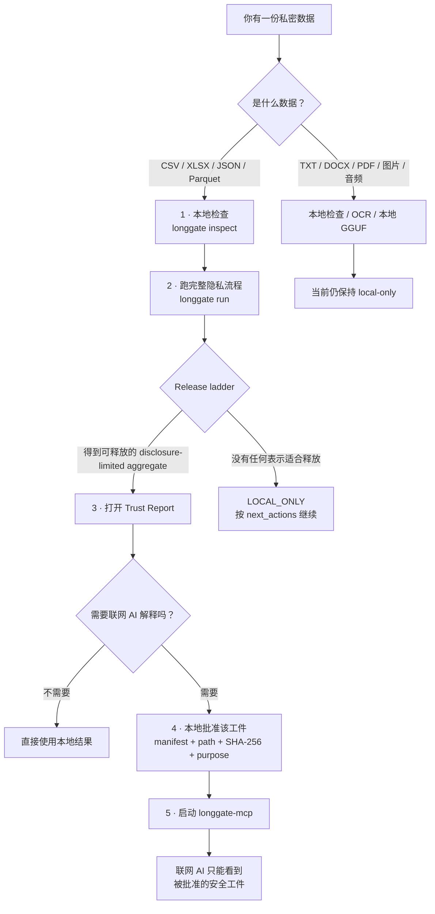

<div align="center">

# Long Gate

### 让 AI 理解敏感数据，而不是把敏感数据交给 AI。

**面向 AI Agent 的 local-first 隐私网关与能力边界。**

[English](README.md) · [5 分钟上手](docs/getting-started.md) · [FAQ](docs/faq.md)

</div>

---

## 30 秒看懂

Long Gate 的核心不是“提醒 AI 不要泄露”，而是：

> **如果联网 AI 不应该看到原始数据，就不要给它读取原始数据的能力。**

当前 pre-1.0 基线中：

```text
原始 row-level 数据          → 不允许联网
pseudonymized row-level     → 不允许联网
row-level synthetic         → 硬锁，不自动联网释放
经过限制的 aggregate        → 通过 policy + final scan + 本地批准后可读
TXT / PDF / 图片 / OCR / 音频 → 当前默认仅本地
```

---

# 普通用户到底怎么用？



最重要的一点：

> **“Long Gate 处理成功”不等于“这个结果已经允许给联网 AI 看”。**

Long Gate 把这几件事拆开：

```text
本地计算
  ↓
隐私 / disclosure gate
  ↓
egress 工件
  ↓
本地人工批准
  ↓
联网 Agent 才能读取
```

---

## 我应该运行哪条命令？

| 你的目的 | 命令 |
|---|---|
| 看环境能力 | `longgate doctor` |
| 看表格里哪些列可能敏感 | `longgate inspect study.csv` |
| 跑完整 structured-data 流程 | `longgate run study.csv --profile research` |
| 做真实统计 | `longgate exact study.csv ...` |
| 把安全结果交给联网 AI | `run` → 看报告 → `approve-egress` → `longgate-mcp` |
| 检查 DOCX/PDF | `longgate document-inspect ...` |
| 图片 / 扫描 PDF OCR | `image-ocr-local` / `pdf-ocr-local` |
| 用本地 LLM 处理访谈文本 | `model setup` → `semantic-transform-local` |
| 让 coding AI 帮你配置 | `longgate setup-prompt` |

---

# 第一次真正使用：处理一份私密表格

假设你有：

```text
study.csv
```

里面是研究参与者、员工、学生、临床或其他敏感数据。

## 1. 安装

```bash
git clone https://github.com/CochraneK/long-gate.git
cd long-gate

python -m venv .venv
source .venv/bin/activate      # Windows: .venv\Scripts\activate

pip install -e .
```

检查：

```bash
longgate doctor
```

## 2. 先只检查，不释放

```bash
longgate inspect study.csv
```

它会告诉你：

- 行列规模；
- 哪些列像 identifier；
- 哪些列像 quasi-identifier / sensitive；
- PII 命中数量。

默认输出的是**计数和分类**，不是把匹配到的真实隐私值直接打印出来。

## 3. 跑完整流程

```bash
longgate run study.csv --profile research --backend auto
```

会返回类似：

```json
{
  "run_id": "LG-...",
  "status": "...",
  "output": "longgate-runs/LG-...",
  "report": "longgate-runs/LG-.../report/trust-report.html",
  "release_class": "aggregate",
  "next_actions": [],
  "safe_payload": "longgate-runs/LG-.../egress/safe_aggregate.json"
}
```

实际值取决于你的数据。

Long Gate 会尝试：

```text
本地 synthetic
   ↓
privacy audit
   ↓
row-level synthetic 仍然 hard-lock
   ↓
尝试 disclosure-limited aggregate
   ↓
final PII scan
   ↓
通过 → 写入 egress/
失败 → LOCAL_ONLY + next_actions
```

所以 `BLOCKED` 不是死路。系统会继续尝试更安全的表示，但不会降低政策标准。

---

# 如果我要做真实统计呢？

真实统计不需要把原始表传给云端 AI。

例如：

```bash
longgate exact study.csv describe

longgate exact study.csv ols \
  --outcome score \
  --predictor age \
  --predictor group
```

还可以用固定模板 R：

```bash
longgate exact study.csv ols \
  --engine r \
  --outcome score \
  --predictor age
```

真实数据留在本地，结果再经过 aggregate guard / disclosure limiting。

---

# 如果我真的想让 ChatGPT / Claude / Codex 一类联网 AI 解释结果呢？

**不要上传 `study.csv`。**

先跑：

```bash
longgate run study.csv --profile research
```

然后打开命令返回的 Trust Report：

```text
longgate-runs/LG-.../report/trust-report.html
```

确认：

- 哪些列被视为 identifier；
- row-level 为什么被拦；
- 是否启用了 aggregate fallback；
- final egress scan 是否通过；
- 是否真的生成了 `safe_payload`。

如果得到：

```text
longgate-runs/LG-123/egress/safe_aggregate.json
```

本地批准：

```bash
longgate approve-egress \
  longgate-runs/LG-123/egress/safe_aggregate.json \
  --workspace longgate-runs/LG-123/egress \
  --ledger ./longgate-policy/approvals.jsonl \
  --purpose "interpret aggregate statistics"
```

Long Gate 现在要求批准同时满足：

```text
Long Gate egress manifest
+ artifact filename
+ artifact SHA-256
+ policy allow=true
+ final scan passed
+ exact purpose
```

所以：

> **把任意文件复制进 `egress/` 并不能把它变成“可给 AI 看”的文件。**

如果文件在批准后发生变化，hash 不再匹配，批准自动失效。

---

## 启动 MCP 边界

```bash
pip install -e '.[mcp]'
```

macOS / Linux：

```bash
export LONGGATE_SAFE_WORKSPACE=/absolute/path/to/longgate-runs/LG-123/egress
export LONGGATE_APPROVAL_LEDGER=/absolute/path/to/longgate-policy/approvals.jsonl
export LONGGATE_ACCESS_LOG=/absolute/path/to/longgate-policy/access.jsonl

longgate-mcp
```

PowerShell：

```powershell
$env:LONGGATE_SAFE_WORKSPACE="C:\path\to\longgate-runs\LG-123\egress"
$env:LONGGATE_APPROVAL_LEDGER="C:\path\to\longgate-policy\approvals.jsonl"
$env:LONGGATE_ACCESS_LOG="C:\path\to\longgate-policy\access.jsonl"

longgate-mcp
```

然后让你的 MCP-compatible AI 客户端启动 `longgate-mcp`。

联网侧只有：

```text
gate_info()
list_safe_files(purpose)
read_safe_text(relative_path, purpose)
```

它没有：

- 任意 filesystem；
- 私密目录浏览；
- approval 创建能力；
- shell；
- 任意 Python；
- `--force-release`。

---

# 私密文本、访谈、PDF、图片、音频

安装：

```bash
pip install -e '.[documents,media,ocr]'
```

使用：

```bash
longgate document-inspect report.docx
longgate document-inspect transcript.pdf

longgate image-inspect photo.jpg
longgate image-ocr-local scan.png
longgate pdf-ocr-local scanned.pdf --max-pages 50

longgate audio-inspect interview.wav
```

OCR 没有云端 fallback。

这些路径当前**不会自动获得网络 egress 权限**。

---

# 本地 LLM 处理私密文本

Long Gate 把两个阶段明确分开：

```text
MODEL SETUP MODE
网络：YES
私密数据：NO
Model Vault：WRITE
        ↓
PRIVATE PROCESSING MODE
网络：NO
私密数据：YES
Model Vault：READ ONLY
```

安装：

```bash
pip install -e '.[models,local-llm]'
```

配置：

```bash
longgate model setup
longgate model verify auto
```

当前内存指导：

| 系统内存 | 默认 |
|---:|---|
| ~8 GB | `qwen3-4b` |
| ~16 GB | `qwen3-8b` |
| ~24 GB+ | `qwen3-14b` |

本地处理：

```bash
longgate semantic-transform-local interview.txt \
  --model auto \
  --out preview.txt
```

`auto` 只读取已经安装并验证过的本地模型，不在 private-processing 阶段下载。

当前 semantic output 仍然：

```text
release_allowed = false
```

也就是说：可以本地用，但不能把“模型改写过”自动等同于“匿名了”。

---

# 一个 run 里有哪些文件？

```text
longgate-runs/LG-.../
├── manifest.json
├── audit.json
├── provenance.json
├── safe/
│   └── synthetic.csv
├── egress/
│   ├── aggregate_egress_manifest.json
│   └── safe_aggregate.json
└── report/
    └── trust-report.html
```

不一定每次都有 `safe_aggregate.json`。如果没有合适的可释放表示，`egress/` 可能只有拒绝/审计信息。

---

# Trust Report

Trust Report 是离线、自包含 HTML。

它会告诉你：

- 什么留在本地；
- 哪些列被识别为 identifier / sensitive；
- 哪些 privacy attacks 被检查；
- row-level 为什么被拦；
- 是否发生 aggregate fallback；
- final egress scan 是否通过；
- 哪个工件获得 egress eligibility；
- 输入 hash、policy、版本、provenance。

---

# 当前安全边界

```text
RAW rows                     → NEVER network eligible
PSEUDONYMIZED rows           → NEVER network eligible
ROW-LEVEL synthetic          → pre-1.0 HARD LOCK
UNKNOWN purpose              → BLOCK
final PII hit                → BLOCK
unsafe small group           → SUPPRESS / BLOCK
任意复制进 egress 的文件       → 不能批准
批准后 artifact 被修改         → hash 不匹配，访问失败
free text / OCR / media      → LOCAL ONLY baseline
path / symlink escape        → BLOCK
```

Long Gate 没有 `--force-release`。

---

# 它不声称什么

Long Gate 当前**不声称**：

- synthetic data 自动等于匿名；
- orchestration layer 自带 formal differential privacy；
- 已获得 HIPAA / GDPR / NHS 等合规认证；
- row-level synthetic 已达到 production release 标准；
- 任意 free text / PDF / image / audio 已证明语义匿名；
- 能抵御已被攻陷的 host OS / administrator。

---

# 核心理念

1. **Capabilities beat prompts**  
   不该让联网 AI 看到 raw data，就不要给它读 raw data 的能力。

2. **Purpose determines disclosure**  
   不同问题，只给最小必要表示。

3. **Evidence is not authorization**  
   隐私测试通过，不等于自动获得网络权限。

4. **Blocked should lead somewhere safer**  
   被拦后继续向更安全的 disclosure level 降级，而不是直接停死。

5. **安全边界必须可执行**  
   关键承诺都应该有测试，而不是只写在 README。

---

## 文档

- [Getting Started — 5 minutes](docs/getting-started.md)
- [FAQ](docs/faq.md)
- [Troubleshooting](docs/troubleshooting.md)
- [Architecture](docs/architecture.md)
- [Threat model](docs/threat-model.md)
- [Security invariants](docs/security-invariants.md)
- [Agent boundary](docs/agent-boundary.md)
- [Egress approval ledger](docs/approval-ledger.md)
- [Release ladder](docs/release-ladder.md)
- [Local Model Guide](docs/models.md)
- [Benchmarks](docs/benchmarks.md)

---

## License

Long Gate 自身代码使用 **Apache-2.0**。

第三方依赖保留各自许可证，见 [THIRD_PARTY_NOTICES.md](THIRD_PARTY_NOTICES.md)。
