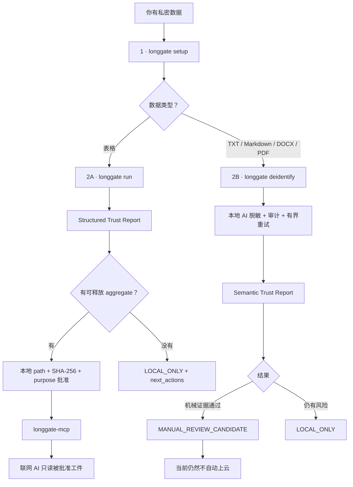

<div align="center">

# Long Gate

### 让 AI 理解敏感数据，而不是把敏感数据交给 AI。

**面向 AI Agent 的 local-first 隐私网关与能力边界。**

[English](README.md) · [5 分钟上手](docs/getting-started.md) · [Roadmap](ROADMAP.md)

</div>

---

## 30 秒看懂

Long Gate 不依赖一句“请不要泄露”。它的原则是：

> **如果联网 AI 不应该看到原始数据，就不要给它读取原始数据的能力。**

当前 pre-1.0 基线：

```text
原始 row-level 数据            → 不允许联网
pseudonymized row-level       → 不允许联网
row-level synthetic           → 硬锁
安全 disclosure-limited aggregate → 可进入明确审批链
本地 AI 语义脱敏结果             → 当前仍 local-only
```

---

# 现在最简单的用法

安装本地模型与文档处理能力：

```bash
git clone https://github.com/CochraneK/long-gate.git
cd long-gate
python -m venv .venv
source .venv/bin/activate      # Windows: .venv\Scripts\activate
pip install -e '.[models,local-llm,documents]'
```

先只看机器适合什么：

```bash
longgate setup --recommend-only
```

Long Gate 会**本地**检测：

- 操作系统 / 架构；
- CPU 逻辑核心数；
- RAM；
- Model Vault 所在磁盘剩余空间；
- 本机有 `nvidia-smi` 时的 NVIDIA GPU / VRAM；
- FAST / BALANCED / QUALITY 三档模型适配情况。

不下载时只做推荐；真正配置：

```bash
longgate setup
```

会自动完成：

```text
硬件检查
  ↓
RAM-led 模型推荐
  ↓
下载固定 revision
  ↓
SHA-256 校验
  ↓
写入 Model Vault
  ↓
READY
```

Setup Mode 可以联网，但不应该挂载或打开私密数据。

---

# 两条主路径



最重要的一点：

> **处理成功 ≠ 已获准给联网 AI 看。**

---

# 路线 A：私密表格

```bash
longgate inspect study.csv
longgate run study.csv --profile research --backend auto
```

Structured release ladder：

```text
row-level synthetic
   ↓ pre-1.0 hard-lock
disclosure-limited aggregate
   ↓ 如果仍不适合
LOCAL_ONLY + next_actions
```

真实统计可以继续留在本机：

```bash
longgate exact study.csv describe
longgate exact study.csv correlation
longgate exact study.csv ols --outcome score --predictor age --predictor group
```

---

# 路线 B：本地 AI 语义脱敏

推荐直接使用产品级入口：

```bash
longgate deidentify interview.txt \
  --model auto \
  --out deidentified.txt
```

它不是简单地“让 LLM 改写一下”，而是：

```text
原始私密文档
  ↓
deterministic 本地 pre-scrub
  ↓
已验证本地 GGUF
  ↓
语义级 identity-detaching transform
  ↓
和 ORIGINAL source 比较
  ↓
PII / 精确数字 / n-gram / distinctive token 审计
  ↓
不够安全？
  ├─ 再做一轮本地语义泛化
  └─ 最多总共 3 轮
  ↓
MANUAL_REVIEW_CANDIDATE 或 LOCAL_ONLY
```

默认最多 2 轮，也可以明确设为 1–3：

```bash
longgate deidentify interview.txt \
  --model auto \
  --out deidentified.txt \
  --max-rounds 3
```

失败不会无限循环，也不会自动降低阈值。

输出：

```text
deidentified.txt
deidentified.txt.audit.json
deidentified.txt.trust-report.html
```

Semantic Trust Report 会记录：

- input SHA-256；
- 本地模型；
- 每轮风险指标；
- PII / 数字复用 / n-gram / distinctive-token 风险；
- failed conditions；
- 最终状态；
- next actions。

**它不会把原文或脱敏正文重新嵌入报告。**

当前即使达到：

```text
MANUAL_REVIEW_CANDIDATE
```

仍然是：

```text
manual_review_required = true
automatic_release_allowed = false
release_allowed = false
```

所以“本地 AI 脱敏过”不等于“已经证明匿名”。

---

# 当前 Semantic evidence

`semantic-release-evidence-v1` 进入人工复核候选的机械阈值：

- direct PII = 0；
- 原文精确数字复用 = 0；
- character n-gram reuse ≤ 1%；
- distinctive token reuse ≤ 5%；
- 输出长度 ≥ 80 字符。

后续仍要继续研究：

- rare-event leakage；
- relationship leakage；
- combination uniqueness；
- 多语言 semantic attacks；
- 长文档 privacy-aware segmentation + cross-chunk audit。

---

# 硬件推荐

```bash
longgate hardware
```

当前 curated tiers：

| 档位 | 模型 | 用途 |
|---|---|---|
| FAST | `qwen3-4b` Q4_K_M | 更轻、更快 |
| BALANCED | `qwen3-8b` Q4_K_M | 中等内存的平衡选择 |
| QUALITY | `qwen3-14b` Q4_K_M | 更强语义泛化 |

最终默认仍以 RAM 为主要依据，因为 GPU offload 还取决于本机 llama.cpp build。

GPU 探测失败不会联网查询，也不会阻止 CPU-only 使用。

---

# 让联网 AI 读安全结果

当前这条自动批准链适用于 **supported structured egress artifact**，例如 disclosure-limited aggregate，不适用于 semantic text。

```bash
longgate approve-egress \
  longgate-runs/LG-123/egress/safe_aggregate.json \
  --workspace longgate-runs/LG-123/egress \
  --ledger ./longgate-policy/approvals.jsonl \
  --purpose "interpret aggregate statistics"
```

批准要求同时匹配：

```text
Long Gate egress manifest
+ policy allow=true
+ final scan passed
+ artifact filename
+ artifact SHA-256
+ exact purpose
```

任意复制进 `egress/` 的文件不能被批准；批准后改文件，hash 失效。

MCP 侧只有：

```text
gate_info()
list_safe_files(purpose)
read_safe_text(relative_path, purpose)
```

没有 arbitrary filesystem、shell、Python、approval creation 或 `--force-release`。

---

# Setup Mode 和 Private Processing 必须分开

```text
MODEL SETUP MODE
网络：YES
私密数据：NO
Model Vault：WRITE

PRIVATE PROCESSING MODE
网络：NO
私密数据：YES
Model Vault：READ ONLY
```

Long Gate 真正要切断的是：

> **同一个进程既能读原始敏感数据，又能自由联网。**

---

# 其他 local-only 能力

```bash
longgate document-inspect report.docx
longgate document-inspect transcript.pdf
longgate image-inspect photo.jpg
longgate image-ocr-local scan.png
longgate pdf-ocr-local scanned.pdf --max-pages 50
longgate audio-inspect interview.wav
```

OCR 没有云端 fallback。

---

# 当前硬安全边界

```text
RAW rows                         → NEVER network eligible
PSEUDONYMIZED rows               → NEVER network eligible
ROW-LEVEL synthetic              → pre-1.0 HARD LOCK
semantic de-identification       → LOCAL ONLY baseline
semantic retries                 → 最多 3 轮
semantic Trust Report            → 不嵌入 narrative content
UNKNOWN purpose                  → BLOCK
final structured PII hit         → BLOCK
任意复制进 egress 的文件           → 不能批准
批准后 artifact 改变              → hash 不再匹配
hardware detection failure       → 不使用远程 fallback
```

---

# Long Gate 不声称什么

目前不声称：

- synthetic data 自动匿名；
- semantic de-identification 自动匿名；
- orchestration layer 自带 formal differential privacy；
- HIPAA / GDPR / NHS 等合规认证；
- row-level synthetic 已获 production release certification；
- 任意文本 / 图片 / 音频 / PDF 已获得语义匿名保证；
- 能抵御已经被攻陷的 host OS / administrator。

---

# 核心理念

1. **Capabilities beat prompts**：不该读 raw data，就不给读取能力。
2. **Purpose determines disclosure**：只披露完成任务所需的最小表示。
3. **Evidence is not authorization**：测试通过不等于自动获得网络权限。
4. **Blocked should lead somewhere safer**：优先 remediation / 降级，而不是弱化政策。
5. **Local AI is a transformer, not the privacy authority**：模型输出还要独立审计。

---

## 文档

- [Getting Started](docs/getting-started.md)
- [Local semantic privacy path](docs/semantic-preview.md)
- [Local Model Guide](docs/models.md)
- [Security invariants](docs/security-invariants.md)
- [Threat model](docs/threat-model.md)
- [Agent boundary](docs/agent-boundary.md)
- [Roadmap](ROADMAP.md)

---

Long Gate 自身代码使用 Apache-2.0 License。
